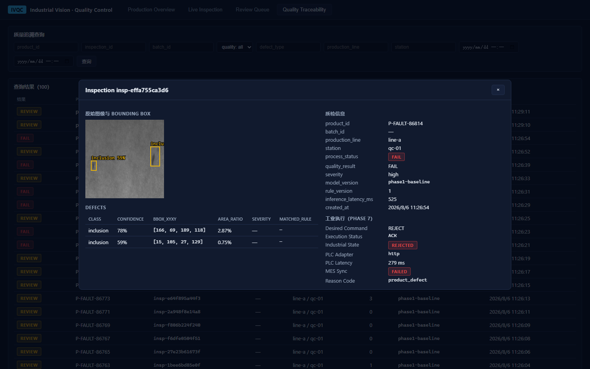
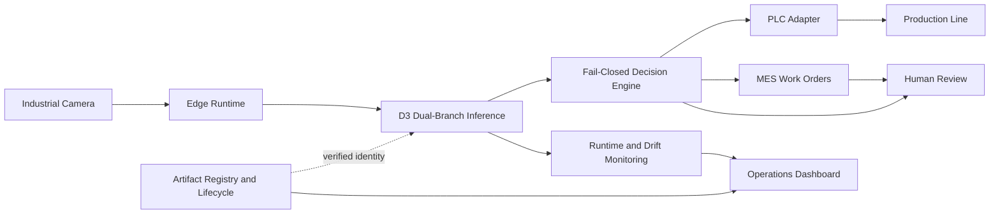
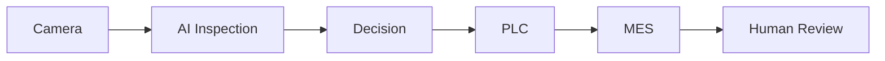
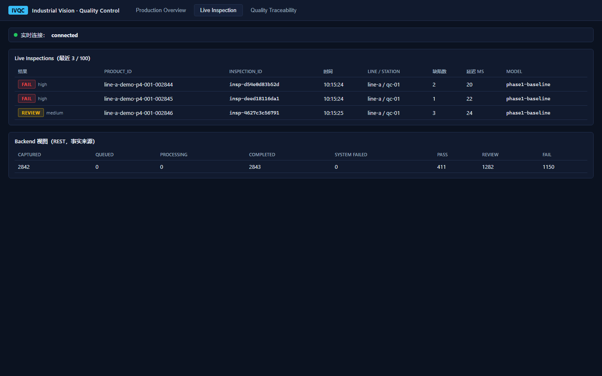
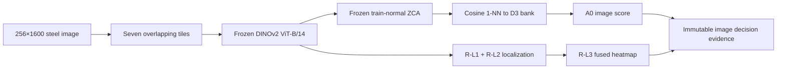
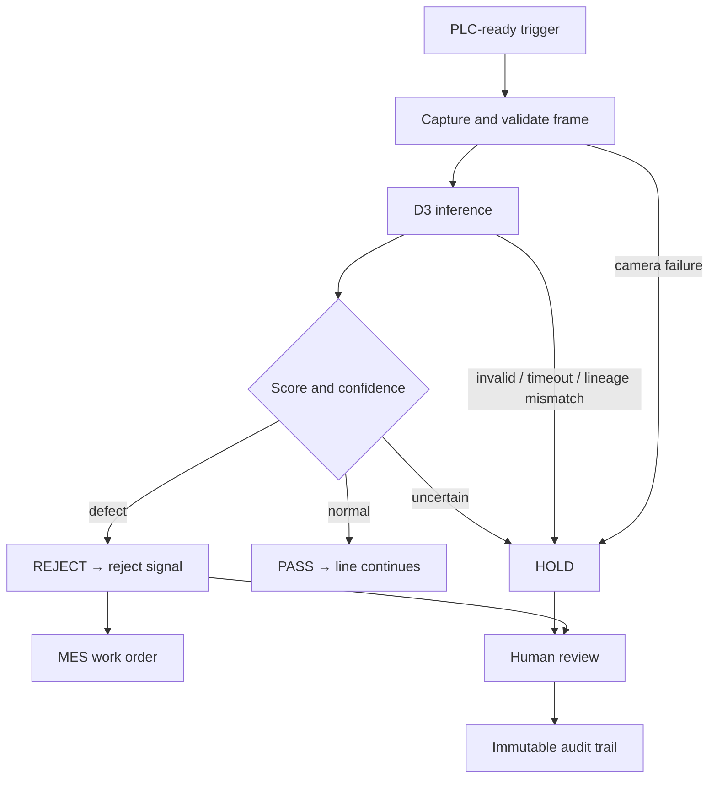

# Industrial Vision AI Quality Inspection Platform

[](LICENSE)


An engineering reference implementation of an industrial visual-inspection system: image acquisition, anomaly detection, pixel localization, fail-closed decisions, PLC/MES coordination, human review, edge runtime monitoring, drift detection, and model lifecycle governance.

The repository focuses on system boundaries and verification evidence. The D3 model is a frozen release candidate; the field-device layer is simulator-backed and requires site acceptance before production use.



## Overview

The platform models a complete quality-control path around steel surface inspection:

- frozen DINOv2 + ZCA anomaly scoring for image-level detection;
- an independent multi-scale localization branch for defect heatmaps;
- an industrial camera contract with trigger, frame identity, and health semantics;
- PASS / REJECT / HOLD decisions with fail-closed exception handling;
- idempotent PLC commands, MES work orders, and audited human review;
- edge lifecycle, resource telemetry, feature-space drift monitoring, and rollback;
- SHA-256-bound model manifests and append-only lifecycle history.

The core design rule is separation of concerns: model evidence, business decisions, industrial execution, and operator decisions remain independently traceable.

## System Architecture



Detailed diagrams and trust boundaries:

- [System architecture](docs/architecture/system-architecture.md)
- [AI and industrial data flows](docs/architecture/data-flow.md)
- [Deployment and MLOps architecture](docs/architecture/deployment-architecture.md)

## Key Features

| Capability | Engineering behavior |
|---|---|
| DINOv2 + ZCA adaptation | Frozen ViT-B/14 patch tokens are whitened with train-normal-only statistics; no anomaly labels or holdout samples enter adaptation. |
| Image anomaly detection | Cosine 1-NN against a frozen 50,000-row bank; seven-tile A0 global-max score. |
| Pixel localization | Independent R-L3 multi-scale branch preserves the D3 image score while producing a 256×1600 heatmap. |
| Camera abstraction | Vendor-neutral connect / trigger / capture / health contract with deterministic virtual-camera replay. |
| Industrial control | PASS, REJECT, and HOLD map to explicit PLC actions; unknown or invalid states never become PASS. |
| MES and review | REJECT creates an idempotent work order; REJECT/HOLD evidence enters an audited review workflow. |
| Edge runtime | Config-driven service lifecycle, health probes, resource monitoring, and container readiness. |
| Drift monitoring | PSI, cosine-distribution shift, and standardized embedding distance produce NORMAL / WARNING / CRITICAL states. |
| MLOps lifecycle | DEVELOPMENT → VALIDATED → CANDIDATE → PRODUCTION → RETIRED with artifact, hash, metric, and rollback gates. |

## Demo Showcase



The diagram is the inspection narrative used for the portfolio walkthrough. At runtime, the decision engine drives PLC, MES, and review through separate idempotent adapters, and any invalid or unavailable dependency follows the fail-closed HOLD path.



This screenshot is from the repository's dashboard running deterministic demo data; it is not a physical production-line image. Explore the [complete demo](docs/demo/demo-showcase.md), [architecture and flow assets](docs/demo/assets/README.md), and [dashboard screenshot guide](docs/demo/assets/dashboard-showcase.md).

## AI Pipeline

The first steel-domain PatchCore baseline used ImageNet WideResNet-50-2 features. It retained pixel-level signal but failed at image ranking: image AUROC was `0.4817`, the anomaly median was below the normal median, and threshold tuning could not repair the representation ordering.

The investigation separated four questions:

1. Is the image aggregation wrong?
2. Is memory-bank coverage insufficient?
3. Is spatial context missing?
4. Is the feature representation misaligned with steel texture?

Aggregation and post-processing experiments did not recover validity. Frozen DINOv2 patch tokens improved representation quality, and train-normal ZCA aligned the metric geometry with steel surface statistics without fine-tuning the backbone.



The final dual-branch candidate intentionally uses different representations for different objectives: D3-ZCA for image ordering and R-L3 for localization. Localization cannot change the image score or threshold.

See [anomaly detection](docs/ai/anomaly-detection.md), [D3 domain adaptation](docs/ai/d3-domain-adaptation.md), and [representation investigation](docs/ai/representation-investigation.md).

## Industrial Closed Loop



Every product produces one traceable event carrying product, batch, camera, model, artifact, decision, PLC, MES, and operator states. PLC commands are idempotent by command ID. Camera, inference, artifact, drift, and communication failures are converted to HOLD rather than optimistic release.

See [camera integration](docs/industrial/camera-integration.md), [PLC/MES loop](docs/industrial/plc-mes-loop.md), [edge runtime](docs/industrial/edge-runtime.md), and [drift monitoring](docs/industrial/drift-monitoring.md).

## Deployment

The edge topology keeps model assets outside container images:

- Docker packages the runtime and health probes;
- model manifests and artifacts are mounted read-only;
- the loader verifies dependency lock, candidate manifest, qualification reports, and every artifact hash before model construction;
- runtime state and resource history are exposed through health and operations APIs;
- rollback selects a previously verified version and never edits artifact bytes.

The repository does not contain model weights, memory banks, datasets, runtime databases, or production credentials. A source checkout therefore supports code review and simulator-backed testing; D3 inference requires the separately managed frozen artifacts.

Operational guides:

- [Deployment guide](docs/operations/deployment-guide.md)
- [Operation manual](docs/operations/operation-manual.md)
- [Rollback guide](docs/operations/rollback-guide.md)

## Evaluation

Model quality is reported together with operational evidence; an accuracy number alone is not a deployment decision.

| Gate | Result | Scope |
|---|---:|---|
| D3 sealed image AUROC | `0.817907171428` | 591 normal + 3,333 anomaly images |
| D3 bootstrap 95% CI | `[0.7967992294, 0.8377211833]` | sealed recovery holdout |
| R-L3 pixel AUROC | `0.924139385743` | independent localization branch |
| R-L3 AUPRO | `0.799398106991` | region-overlap quality |
| Image-score mismatches after dual integration | `0` | D3 branch immutability |
| Production-readiness qualification | `PASS` | stability, robustness, monitoring, review, rollback, tests |
| Factory acceptance | `PASS` | pipeline, throughput, PLC/MES, drift, feedback, tests |
| Current default repository suite | `630 passed` | `1 skipped`, `27 deselected` environment-specific gates |

The threshold `0.8471092581748962` is frozen. Its conservative operating-point recall is documented separately from rank-based model validity; the repository does not hide that trade-off.

Primary evidence: [dual-branch report](docs/dual-branch-evaluation-report.md), [production readiness](docs/d3-production-readiness-report.md), [factory acceptance](docs/d3-factory-acceptance-report.md), and [test matrix](docs/test-matrix.md).

## Documentation

| Area | Entry point |
|---|---|
| Architecture | [System](docs/architecture/system-architecture.md) · [Data flow](docs/architecture/data-flow.md) · [Deployment](docs/architecture/deployment-architecture.md) |
| AI | [Anomaly detection](docs/ai/anomaly-detection.md) · [D3 adaptation](docs/ai/d3-domain-adaptation.md) · [Representation investigation](docs/ai/representation-investigation.md) |
| Industrial engineering | [Camera](docs/industrial/camera-integration.md) · [Protocols](docs/industrial/protocol-adaptation.md) · [PLC/MES](docs/industrial/plc-mes-loop.md) · [Edge](docs/industrial/edge-runtime.md) · [Drift](docs/industrial/drift-monitoring.md) |
| Industrial integration | [Network topology](docs/industrial/integration/industrial-network-topology.md) · [Protocol adaptation guide](docs/industrial/integration/protocol-adaptation-guide.md) · [Factory integration guide](docs/industrial/integration/factory-integration-guide.md) |
| Operations | [Deployment](docs/operations/deployment-guide.md) · [SOP](docs/operations/operation-manual.md) · [Rollback](docs/operations/rollback-guide.md) |
| Release showcase | [v1.0.0 notes](docs/release/v1.0.0-release-notes.md) · [Demo flow](docs/demo/demo-showcase.md) |
| Design decisions | [DINOv2](docs/decisions/why-dinov2.md) · [ZCA](docs/decisions/why-zca.md) · [Dual branch](docs/decisions/why-dual-branch.md) · [Failed experiments](docs/decisions/failed-experiments.md) |
| Technical interview trace | [Deep dive](docs/interview/technical-deep-dive.md) · [Architecture](docs/interview/architecture-questions.md) · [AI](docs/interview/ai-model-questions.md) · [Industrial](docs/interview/industrial-engineering-questions.md) |

## Repository Map

```text
backend/              FastAPI APIs, persistence, review, registry, quality rules
inference-service/    vision contract, YOLO/PatchCore/D3 predictors, inference tests
industrial_loop/      camera, decision, PLC, MES, review, factory simulation
industrial_runtime/   edge lifecycle, configuration, resource monitoring
monitoring/           feature-drift collection, metrics, alerts, scenarios
model_governance/     lifecycle journal, fail-closed promotion and rollback
frontend/             React/TypeScript operations dashboard
model-training/       experiment code and committed manifests; artifacts are ignored
docs/                 evidence reports, architecture, decisions, and operating guides
```

## Local Verification

```powershell
# Python default suite; environment-specific gates are selected by pytest markers
.\.venv\Scripts\python.exe -m pytest -q

# Disposable model-lifecycle rollback drill; does not touch D3 artifacts
.\.venv\Scripts\python.exe -m model_governance.rollback_simulation

# Frontend unit tests
Set-Location frontend
npm test
```

For a service demo, start PostgreSQL with `docker compose up -d postgres`, then follow the environment-specific steps in [the deployment guide](docs/operations/deployment-guide.md). GPU inference remains a local gate because frozen artifacts and qualified hardware are not committed to Git.

## Scope and Limitations

- The D3 package is production-candidate-qualified, not a production deployment authorization.
- Camera, PLC, MES, and OPC UA validation is simulator-backed; physical gateways require site acceptance testing.
- The model evidence covers one frozen steel dataset and one sealed recovery holdout.
- Runtime artifacts and datasets are intentionally absent from Git.
- ROI values in the business analysis are simulation assumptions, not financial claims.
- The repository source is Apache-2.0 licensed; third-party dependencies, datasets, pretrained weights, and external artifacts retain their own terms.

The [technical deep dive](docs/interview/technical-deep-dive.md) maps each major claim to code, tests, manifests, and evaluation evidence.

## License

Licensed under the [Apache License 2.0](LICENSE). See [NOTICE](NOTICE) for attribution and third-party scope notes.
