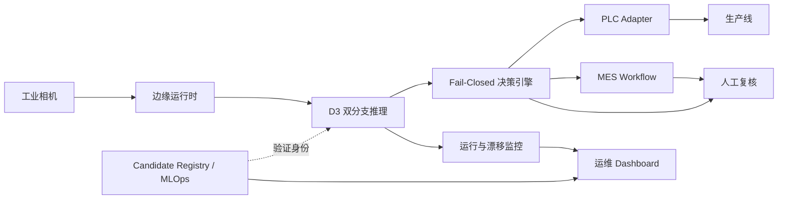
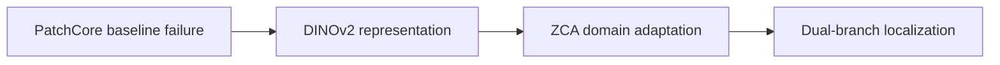

# 工业视觉 AI 质量检测平台

[English](README.md) | [简体中文](README.zh-CN.md)

[](https://github.com/ten10do/Multimodal-API-Vision-Quality-Inspection-and-Automated-Exception-Handling-Platform/actions/workflows/backend-ci.yml)
[](https://github.com/ten10do/Multimodal-API-Vision-Quality-Inspection-and-Automated-Exception-Handling-Platform/actions/workflows/frontend-ci.yml)
[](https://github.com/ten10do/Multimodal-API-Vision-Quality-Inspection-and-Automated-Exception-Handling-Platform/actions/workflows/docs-ci.yml)
[](https://github.com/ten10do/Multimodal-API-Vision-Quality-Inspection-and-Automated-Exception-Handling-Platform/releases/latest)
[](LICENSE)
[](docs/release/model-card.md)
[](docs/demo/demo-showcase.md)

这是一个工业视觉质量检测系统的工程参考实现，覆盖图像采集、异常检测、像素定位、fail-closed 决策、PLC/MES 协同、人工复核、边缘运行、漂移监控和模型生命周期治理。

D3 模型是冻结的生产候选版本；现场设备层采用模拟器验证，真实工厂仍需完成 Shadow、Pilot 和 SAT。仓库不把仿真证据描述为真实产线部署。


## 系统架构



系统严格分离 AI 证据、质量策略、工业执行和人工裁决。相机、推理、artifact、通信或漂移状态不确定时，系统进入 HOLD，而不是默认 PASS。

## AI 技术演进



最初的 ImageNet WideResNet-50-2 PatchCore baseline 保留了局部缺陷信号，但钢材图像排序失效，Image AUROC 为 `0.4817`。聚合、memory-bank coverage 和 spatial-context 调查没有恢复有效排序，因此工程路线转向冻结 DINOv2 patch token，并使用仅由 train-normal 特征拟合的 ZCA 调整钢材域特征几何。

最终候选版本采用目标隔离的双分支：

- D3-ZCA 分支负责 image-level anomaly score；
- 独立 R-L3 多尺度分支负责 pixel localization；
- localization 不允许修改 D3 image score 或冻结 threshold。

完整证据见 [项目总览](docs/project-overview.md)、[异常检测说明](docs/ai/anomaly-detection.md)、[D3 域适配](docs/ai/d3-domain-adaptation.md)和[失败分析](docs/engineering-decisions/failure-analysis.md)。

## 工业能力边界

| 能力 | Implemented | Simulation | Future deployment |
|---|---|---|---|
| Camera Adapter | 连接、触发、采集、帧身份和健康契约 | Virtual camera replay 与故障路径 | 目标相机、镜头、光源、SDK 和触发时序认证 |
| PLC/MES | PASS/REJECT/HOLD、幂等 command ID、确认和工单契约 | PLC/MES simulator、超时、NACK、离线路径 | 真实地址、scan timing、interlock、MES schema 和权限集成 |
| Edge Runtime | 配置校验、生命周期、健康检查和资源监控 | 容器及服务故障注入 | 目标 IPC/GPU、driver、watchdog、温度和冗余认证 |
| Drift Monitoring | NORMAL/WARNING/CRITICAL 策略，不自动调参 | 正常、亮度变化和材料变化场景 | 建立现场 baseline、告警责任与恢复审批 |
| MLOps | Candidate Registry、SHA-256、promotion gate 和 rollback | promotion rejection 与 rollback drill | 接入工厂变更控制、签名、权限和灾备流程 |

工业集成入口：[Camera](docs/industrial/camera-integration.md) · [PLC/MES](docs/industrial/plc-mes-loop.md) · [Edge Runtime](docs/industrial/edge-runtime.md) · [Drift Monitoring](docs/industrial/drift-monitoring.md) · [Factory Integration](docs/industrial/integration/factory-integration-guide.md)

## 验证生命周期

| 阶段 | 当前状态 | 证据边界 |
|---|---|---|
| Offline | **Implemented** | 冻结数据角色、image/pixel 指标、lineage、artifact hash 和 branch invariance |
| Shadow | **Simulation** | 仓库 replay 和历史候选 shadow 证据；尚未完成真实产线 no-actuation shadow |
| FAT | **Simulation** | Virtual device、fault injection 和 accelerated discrete-event workload，不是真实工厂班次 |
| SAT | **Future** | 已有 SAT 方案，但必须由具体工厂使用认证设备、产品、人员和签字标准执行 |

核心评估证据：

| 指标 | 结果 |
|---|---:|
| D3 sealed Image AUROC | `0.817907171428` |
| D3 bootstrap 95% CI | `[0.7967992294, 0.8377211833]` |
| R-L3 Pixel AUROC | `0.924139385743` |
| R-L3 AUPRO | `0.799398106991` |
| 双分支集成后的 image-score mismatch | `0` |

冻结 threshold 为 `0.8471092581748962`。AUROC 表示排序能力，不等同于当前保守 operating point 的 recall。

验证入口：[Validation Strategy](docs/industrial-validation/validation-strategy.md) · [FAT Report](docs/d3-factory-acceptance-report.md) · [Simulated SAT](docs/industrial-validation/site-acceptance-test.md)

## Demo Showcase


截图来自仓库 Dashboard 和确定性仿真数据，不是真实产线照片。完整演示路径为 Camera → AI Inspection → Decision → PLC → MES → Human Review → Drift Monitoring。

查看 [Demo Showcase](docs/demo/demo-showcase.md) 和 [Dashboard 截图说明](docs/demo/assets/dashboard-showcase.md)。

## 文档入口

- [首次访问者项目总览](docs/project-overview.md)
- [系统架构](docs/architecture/system-architecture.md)
- [工程决策与失败分析](docs/engineering-decisions/failure-analysis.md)
- [工业集成](docs/industrial/integration/factory-integration-guide.md)
- [工业验证](docs/industrial-validation/validation-strategy.md)
- [部署与运维](docs/operations/deployment-guide.md)
- [技术面试追溯](docs/interview/technical-deep-dive.md)
- [v1.1.0 Release](https://github.com/ten10do/Multimodal-API-Vision-Quality-Inspection-and-Automated-Exception-Handling-Platform/releases/tag/v1.1.0)

## 本地验证

```powershell
# 文档链接、UTF-8、代码围栏和 Mermaid 提取
.\.venv\Scripts\python.exe scripts\check_docs.py

# Python 默认测试套件
.\.venv\Scripts\python.exe -m pytest -q

# 前端测试和生产构建
Set-Location frontend
npm test
npm run build
```

## 限制

- D3 是 production-candidate-qualified，不是生产授权。
- 模型证据覆盖冻结的钢材数据协议，不能自动外推到其他钢厂、相机、材料或光照。
- Camera、PLC、MES、稳定性、吞吐、FAT 和 rollback 证据包含虚拟设备、确定性 replay 或加速时间。
- 真实部署仍需完成现场数据采集、Shadow、Pilot、SAT、安全联锁、网络安全和运维责任确认。
- 运行所需 D3 weights、whitening 和 banks 不提交到 Git；仓库仅提供代码、manifest 和验证证据。

## License

源代码采用 [Apache License 2.0](LICENSE)，第三方依赖、数据集、预训练权重和外部 artifact 保留各自许可。
