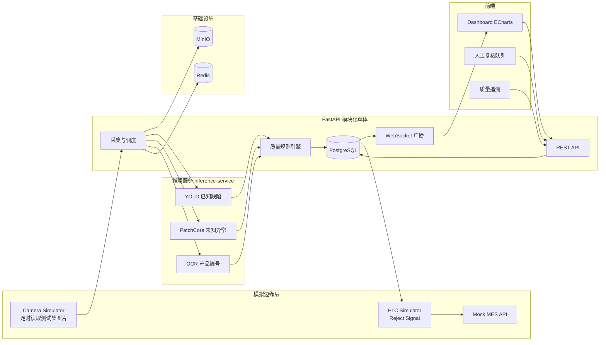

# Phase 0 需求与架构基线

> IndustrialVision-QC 面向智能制造的工业机器视觉质检与质量闭环平台
> 文档版本 v0.1，日期 2026-08-04

## 0. 项目定位

以完整工业质检链路为主线（图像采集 → 预处理 → YOLO 已知缺陷 → PatchCore 未知异常 → OCR 编号 → 质量规则引擎 → PASS/REVIEW/FAIL → 人工复核 → PLC/MES 联动 → 质量追溯 → 模型监控 → 数据反馈 → 持续优化），采用软件模拟方式替代昂贵工业设备，在 300 至 500 元成本内完成一个可完整演示、可复现、可上简历的工程作品。

两个互补的能力叙事：

| 项目 | 技术路线 | 展示能力 |
|---|---|---|
| legacy/vision-qc-agent（已归档） | 多模态 LLM API 质检 + 根因分析 + 工作流 | LLM 应用、状态机、安全降级 |
| IndustrialVision-QC（本项目） | YOLO + PatchCore + OCR + 规则引擎 + MLOps | 传统 CV 工程链路、后端工程、MLOps、工业集成 |

## 1. 当前环境状态

| 项 | 状态 | 影响 |
|---|---|---|
| 工作区 | 已改造，旧项目归档至 legacy/vision-qc-agent，git 干净 | 根目录为新项目 |
| Python | 3.13.14 / 3.11.9（系统）、3.13.12（托管） | 全栈锁定 3.11（见选型） |
| Node.js | v22.22.2 | 满足前端要求 |
| GPU | RTX 5060 8GB（sm_120） | 可本地免费训练 YOLO，需 PyTorch ≥ 2.7（cu128） |
| Docker | 未安装，用户已确认安装 Docker Desktop | Phase 2 起需要 |
| Git | 2.47.1，远程 github.com/ten10do/... | 归档已完成 |

## 2. MVP 范围（Phase 1 至 Phase 4）

一条可完整跑通的链路，不做任何多余分支：

```
Camera Simulator → YOLO 推理 → 质量规则引擎 → PostgreSQL → WebSocket → Dashboard
```

MVP 验收线：模拟器按固定节拍连续出图，系统自动完成检测、判定、入库、实时推送，前端能看到速度、良率、缺陷分布、最近产品与带框图片，且能按 product_id 追溯。

范围外（后续阶段）：PatchCore（Phase 6）、PLC/MES（Phase 7）、MLOps（Phase 8）、Copilot（Phase 9）、OCR（Phase 2 起做但不在 MVP 门禁内）。

## 3. 数据集选型

| 用途 | 数据集 | 规模 | 来源 | 理由 |
|---|---|---|---|---|
| YOLO 训练 | NEU-DET 热轧钢带表面缺陷 | 1800 张 200×200，6 类（crazing/inclusion/patches/pitted_surface/rolled-in_scale/scratches） | Kaggle 镜像（英文源） | 工业表面缺陷标准 benchmark，体积小训练快，缺陷类型与需求中的 scratch/crack 场景匹配 |
| PatchCore | MVTec AD 子集（bottle/screw/metal_nut 等 3 至 4 类） | 每类数百张，含正常与异常 | MVTec 官网申请（英文） | 异常检测标准 benchmark，官方 PatchCore 代码直接支持 |
| OCR | PP-OCRv4 预训练 + 自造合成编号图 | 合成数百张 | 预训练权重 | 产品编号属业务合成场景，合成成本为零且可解释 |

供应链风险与备选：MVTec AD 下载需填表，若受阻则改用 NEU-DET 正常样本 + 合成异常验证 PatchCore 通路。NEU-DET 仅用英文镜像源。

## 4. 技术选型及理由

| 决策点 | 选择 | 理由 |
|---|---|---|
| 检测框架 | ultralytics YOLOv8s | 生态成熟、资料与面试认知度最高、ONNX 导出方便；同一框架下切 YOLO11 只需改一行 |
| 异常检测 | 官方 amazon-science patchcore 包，ResNet-50 骨干 | 免训练（仅特征提取 + coreset 采样），工业异常检测经典基线，有 MVTec 官方数字可对比 |
| OCR | PaddleOCR PP-OCRv4 | 工业场景文字识别强项；风险是 PaddlePaddle 对 Python 3.13 支持滞后，故全栈锁 3.11，备选 EasyOCR |
| 后端形态 | 模块化单体 + 单一推理服务 | 模型生命周期（CUDA 上下文、加载、批处理）与 Web 业务隔离是真实工程约束；GPU 只挂推理服务，贴近边缘部署；其余全部单体 |
| Python 版本 | 全栈 3.11 | 与 PaddlePaddle、PyTorch 轮子兼容性最佳；Docker 镜像锁 3.11-slim |
| 数据层 | PostgreSQL 16 + Redis 7 + MinIO | 关系数据、实时队列/发布订阅、S3 对象存储，均为简历高频词 |
| 前端 | React 18 + Vite + TypeScript + ECharts | 单页仪表盘够用，构建快；Bounding Box 用 Canvas 渲染 |
| 消息 | FastAPI WebSocket 为主，MQTT 可选 | 实时推送用 WS 最简单可靠；MQTT 留到工业集成阶段 |
| MLOps | MLflow + Prometheus + Grafana（Phase 8） | 不过度提前，验证过模型链路后再上 |

## 5. 系统架构



数据流（单件产品）：

```
图片 → 存 MinIO → YOLO bbox → PatchCore 分数 → OCR 编号
     → 规则引擎判定 PASS/REVIEW/FAIL → 写 inspections/defects
     → WebSocket 推送 → FAIL 触发 PLC reject → MES 回传
```

## 6. 数据库模型

| 表 | 关键字段 | 说明 |
|---|---|---|
| batches | batch_id, production_line, product_type, target_qty, started_at, status | 批次 |
| products | product_id（唯一）, batch_id, production_line, station, captured_at, image_path | 产品 |
| inspections | product_id, status, quality_result, anomaly_score, model_version, rule_version, inference_latency_ms, reviewed_by, human_label, reviewed_at | 质检主记录，追溯核心 |
| defects | inspection_id, defect_type, confidence, bbox(x1,y1,x2,y2), area_px, severity, source | 缺陷明细，source 区分 yolo/patchcore/review |
| ocr_results | inspection_id, product_code, confidence, raw_text | OCR 结果 |
| quality_rules | defect_type, confidence_threshold, max_area, severity, action, enabled, version | 规则引擎配置，DB 可改 |
| plc_events | inspection_id, action, timestamp, status | PLC 联动审计 |
| mes_events | inspection_id, event_type, payload(JSONB), timestamp | MES 联动审计 |
| model_registry | name, version, artifact_uri, metrics(JSONB), status, deployed_at | Phase 8 |

关系：product 1→N inspection，inspection 1→N defect，1→1 ocr_result。规则引擎从 quality_rules 表加载，禁止硬编码阈值。

## 7. API 初步设计（前缀 /api/v1）

| 方法 | 路径 | 用途 |
|---|---|---|
| GET | /health, /ready | 存活与就绪 |
| POST | /inspections | 上传图片触发质检（模拟器与手动共用） |
| GET | /inspections?status=&product_id=&page= | 查询质检记录 |
| GET | /inspections/{id} | 单条详情含缺陷与标注图 |
| GET | /products/{product_id}/history | 追溯 |
| GET | /review/queue | 待复核队列 |
| POST | /reviews/{inspection_id} | 人工标注（PASS/缺陷类型/Other） |
| GET/PUT | /rules, /rules/{defect_type} | 规则配置 |
| POST | /rules/validate | 规则变更预校验 |
| GET | /dashboard/summary, /defect-trend, /recent | 仪表盘聚合 |
| POST | /simulator/start, /stop | 相机模拟器控制 |
| POST | /plc/reject, GET /mes/batch/{id} | 工业联动（Phase 7） |
| WS | /ws/dashboard | 实时事件推送 |

统一错误格式携带 request_id，响应头 X-Request-ID（沿用归档项目的最佳实践）。

## 8. 项目目录

```
industrial-vision-qc/
├── backend/            FastAPI 模块化单体（api/core/models/schemas/services + alembic + tests）
├── inference-service/  YOLO + PatchCore + OCR 推理服务（独立容器，GPU 可挂载）
├── simulator/          Camera / PLC / MES 三合一模拟器
├── frontend/           React + Vite + TS + ECharts
├── model-training/     数据集准备、训练、评估、导出脚本
├── monitoring/         Prometheus + Grafana 配置（Phase 8）
├── docs/               架构、API、数据集、部署、演示文档
├── scripts/            dev 工具
├── legacy/             已归档的 vision-qc-agent
└── docker-compose.yml
```

## 9. 开发阶段与验收标准

| Phase | 内容 | 验收标准 |
|---|---|---|
| 0 | 架构基线（本文档） | 评审通过，目录与文档落盘 |
| 1 | Vision MVP | YOLO 对 NEU-DET 测试图输出标准化 JSON（bbox/conf/area/severity），单测通过 |
| 2 | Backend MVP | 图片→推理→规则引擎→PostgreSQL 全链路 API 通，规则可配置 |
| 3 | Realtime Pipeline | 模拟器连续出图，WebSocket 实时推送，Dashboard 数据流动 |
| 4 | Frontend Dashboard | 实时质检、良率、缺陷分布、最近产品、追溯、BBox、REVIEW 队列 |
| 5 | Human Review | AI→REVIEW→人工标注→入库→可导出训练集闭环 |
| 6 | Anomaly Detection | YOLO + PatchCore 融合，Known/Unknown/Normal 三态判定 |
| 7 | Industrial Integration | PLC reject 信号、MES 回传、MQTT 模拟，附替换真实设备说明 |
| 8 | MLOps | model_version 贯穿、MLflow 注册、精度/延迟/吞吐监控、简单漂移检测 |
| 9 | Quality Copilot | LLM 经 Tool Calling 查质量 API 生成分析，不参与视觉判定 |
| 10 | 工程完善 | pytest + GitHub Actions + docker compose up 一键起 + README + 架构图 + 演示脚本 + 简历描述 |

每阶段交付前必须运行测试、检查 git diff、汇报新增/修改文件与测试结果。

## 10. 风险清单

| 风险 | 等级 | 缓解 |
|---|---|---|
| 本机无 Docker | 中 | 用户已确认安装 Docker Desktop；Phase 1 纯 Python 不受阻 |
| PaddlePaddle 与 Python 3.13 兼容 | 中 | 全栈锁 3.11；备选 EasyOCR |
| RTX 5060 (sm_120) 需 PyTorch ≥ 2.7 | 低 | Phase 1 首日验证 CUDA 可用性 |
| MVTec AD 下载需填表 | 低 | 备选 NEU-DET 正常样本 + 合成异常 |
| node_modules 等在 Windows 被监视器锁文件 | 低 | 已总结处理方式（重试循环 + 绝对路径） |
| 模拟器速率压垮浏览器 | 低 | 节拍可配置，默认 1 至 2 秒/件 |

## 11. 下一步

1. 提交本文档与项目骨架
2. 安装 Docker Desktop（并行进行，Phase 2 前完成即可）
3. Phase 1 启动：下载 NEU-DET、建 Python 3.11 venv、验证 torch CUDA、跑通 YOLO 推理并输出标准化结果
