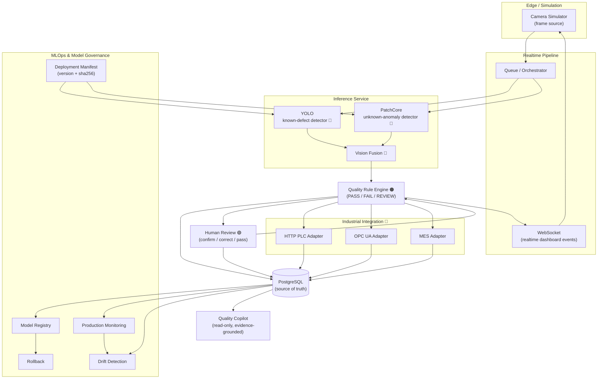

# System Architecture

IndustrialVision-QC is an **end-to-end industrial AI quality inspection
platform**: camera frames flow through a realtime pipeline, YOLO detects
known defects, PatchCore flags unknown anomalies, a rule engine fuses them
into a quality decision, humans review uncertain cases, and the final
decision is executed against the field layer (PLC / MES) — all governed by
an MLOps layer and a read-only Quality Copilot.

## Responsibility boundaries

Four distinct responsibility domains are kept separate by design:

| Marker | Domain | Owns | Never does |
|---|---|---|---|
| 🔵 **AI decision** | Detection & anomaly models | known-defect bboxes, anomaly score, fusion class | does NOT decide final quality |
| 🟢 **Human decision** | Human-in-the-loop review | confirms/corrects/passes on REVIEW cases | does NOT overwrite AI evidence |
| 🟠 **Final quality result** | Rule engine + review resolution | PASS / FAIL / REVIEW (+ system FAILED) | does NOT execute field actions |
| 🔴 **Industrial execution** | PLC / MES adapters | RELEASE / REJECT / HOLD + MES sync, idempotent by command_id | does NOT invent quality results |

## Data flow (one inspection)

1. Camera simulator emits a frame → queue → inference service.
2. YOLO returns known-defect detections (bbox + class + confidence); PatchCore
   returns an anomaly score / heatmap; the fusion step combines them
   (defect present + anomaly → UNKNOWN_ANOMALY).
3. The quality rule engine maps the vision result to a **final quality
   result**: PASS / FAIL / REVIEW (uncertain) / system FAILED.
4. Everything is persisted to PostgreSQL (source of truth); a WebSocket push
   updates the dashboard live.
5. REVIEW cases create a human review task; the human confirms/corrects the
   label or passes the product — the AI evidence is never overwritten.
6. The final result drives an **industrial command** through the PLC adapter
   (HTTP or OPC UA): PASS → RELEASE, FAIL → REJECT, REVIEW → HOLD, with
   idempotency by command_id; the MES adapter receives the real industrial
   state (fail-safe: unknown → SAFE_HOLD, never RELEASE).
7. MLOps records model identity / deployment version / metrics / drift;
   the Quality Copilot answers natural-language questions read-only with
   evidence from the same database.

## Components

| Component | Location | Notes |
|---|---|---|
| Camera simulator | `simulator/` | HTTP PLC, MES, OPC UA simulators + frame pipeline |
| Inference service | `inference-service/` | YOLO + PatchCore + fusion, manifest-verified readiness |
| Backend | `backend/app` | API, rule engine, review, industrial, MLOps, Copilot |
| Frontend | `frontend/` | React + Vite dashboard (Overview / Live / Trace / Review / Model Ops / Copilot) |
| Infrastructure | `docker-compose.yml` | PostgreSQL 16 on host 5433 (native PG keeps 5432) |
