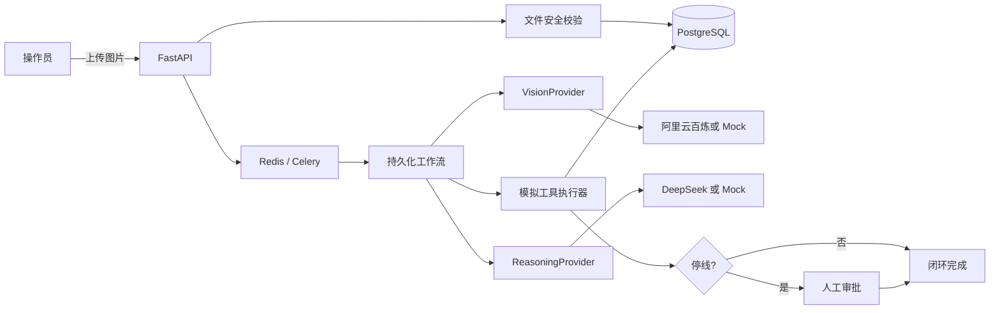
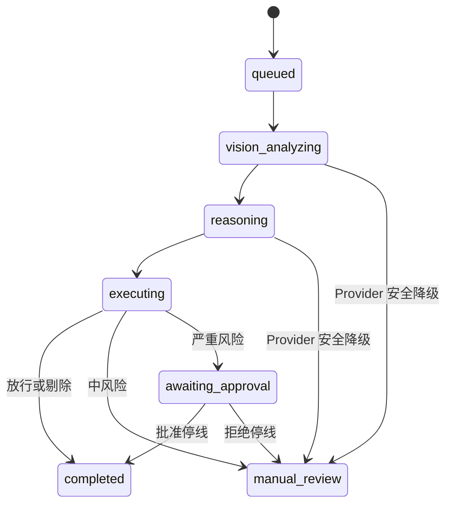

# 架构说明

## 边界与数据流

`VisionProvider` 与 `ReasoningProvider` 是业务层唯一可见的 AI 接口。真实实现使用 `httpx` 调用 OpenAI-compatible HTTP API，不依赖任何厂商 SDK；Mock 实现走同一套 Schema、数据库和工作流。

## 状态机

## Celery 取舍

关键检测不使用 FastAPI `BackgroundTasks`。生产/Docker 模式提交到 Redis-backed Celery，开启 late acknowledgement，并通过数据库任务状态和工具动作幂等键承受重复投递。开发与 CI 的 `CELERY_TASK_ALWAYS_EAGER=true` 只改变执行时机，不绕过数据库、Provider、工作流或审计，因此无需 Redis 也可完整演示。

## 文件存储

当前实现把随机命名的图片保存到受控目录，Docker 使用独立持久卷。数据库只保存元数据和 SHA-256。该设计适合单站点演示；多节点生产环境应将 `validate_and_store_image` 后端替换为对象存储，同时保留随机对象键、内容校验和数据库元数据。
