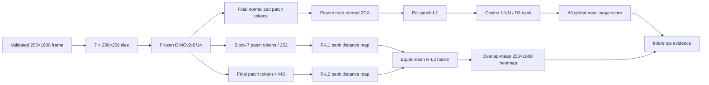
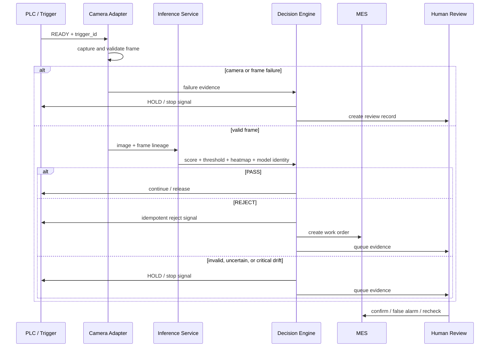

# Data Flow

## AI inference pipeline

The image branch is evaluated before localization. It uses frozen ZCA, the frozen D3 bank, cosine 1-NN, A0 aggregation, and threshold `0.8471092581748962`. The localization branch is independent and cannot supply an image score.

## Industrial control flow

## Persistence and observability

- The closed-loop simulator uses a thread-safe event store; the full backend uses PostgreSQL as source of truth.
- WebSocket is a notification mechanism, not persistence.
- Runtime metrics and drift reports are bounded histories exposed by read-only APIs.
- Model transitions are appended to `model_governance/model_history.json` with version, hash, metrics, operator, timestamp, transition, and approval state.

## Failure propagation

| Origin | Evidence | Downstream behavior |
|---|---|---|
| Camera | offline, capture error, invalid frame | HOLD and operator review |
| Inference | timeout, exception, non-finite/missing fields | HOLD; no reuse of a previous score |
| Lineage | missing artifact, hash or version mismatch | load/promotion blocked; line remains safe |
| PLC | NACK or unacknowledged command | HOLD/review; no assumed execution |
| MES | unavailable workflow endpoint | preserve event for idempotent replay |
| Drift | WARNING | continue with alert and observation |
| Drift | CRITICAL | HOLD; no automatic model change |

## Evidence

- [D3 dual-branch protocol](../d3-dual-branch-protocol.md)
- [Industrial camera design](../industrial-camera-adapter-design.md)
- [Industrial closed-loop design](../industrial-closed-loop-design.md)
- [Human-review workflow](../d3-human-review-workflow.md)
