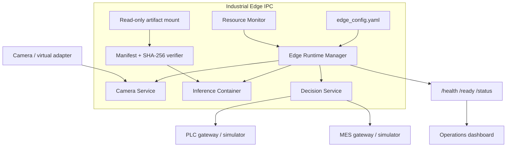
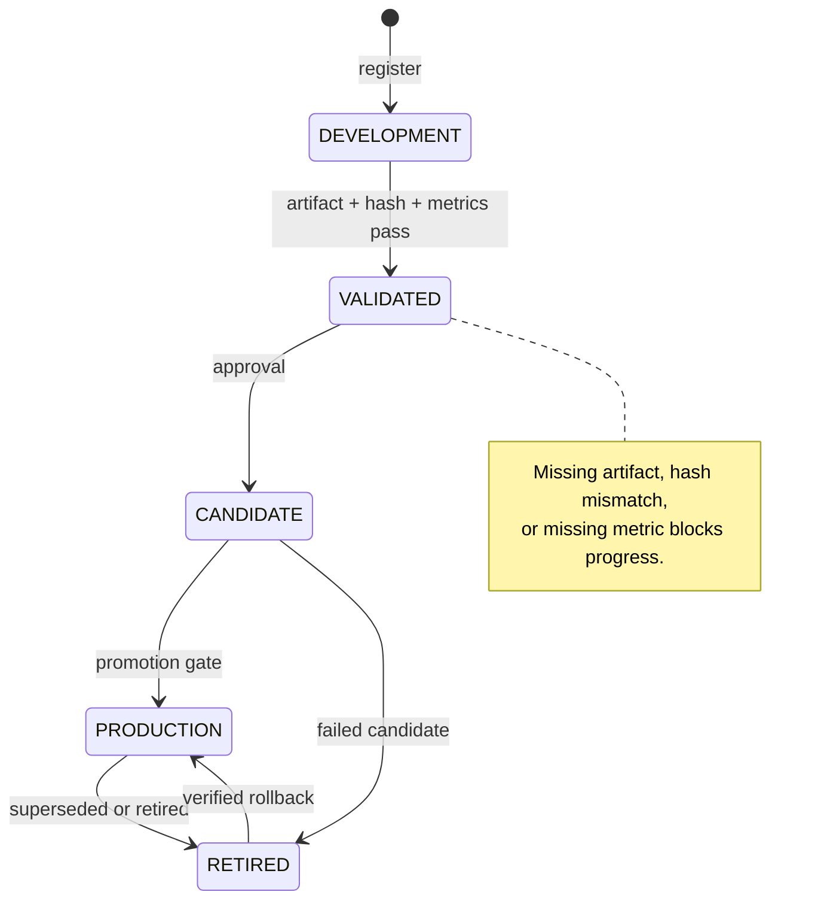

# Deployment Architecture

## Edge topology



The container image contains runtime code and health probes, not model bytes. Manifests and artifacts are mounted read-only and verified before model construction. The default repository can exercise the same contracts with virtual camera and PLC/MES simulators.

## Model lifecycle



## Startup gate

```text
dependency lock
  → release manifest
  → candidate manifest
  → qualification evidence
  → artifact hashes
  → immutable array shape/finite checks
  → smoke inference
  → READY_FOR_MANUAL_RELEASE_REVIEW
```

No stage repairs a mismatch by editing a hash, threshold, bank, or artifact. The approved bytes must be restored from the artifact store or the system remains blocked.

## Network and access boundaries

| Zone | Components | Expected access |
|---|---|---|
| OT | Camera, PLC | Allow-listed connection to edge services only |
| Edge | Runtime, inference, decision | Camera input; controlled PLC/MES output |
| Service | MES, review, dashboard, governance | Event intake and read-only operational views |
| Management | Release and maintenance workstations | Approved maintenance and lifecycle actions |

## Configuration and artifacts

- Runtime configuration: `industrial_runtime/edge_config.yaml`.
- Release identity: `model-training/registry/steel-patchcore-d3-release/1.3.0/manifest.json`.
- Candidate identity: `model-training/registry/steel-patchcore-d3-candidate/1.3.0-candidate.1/manifest.json`.
- Governance journal: `model_governance/model_history.json`.
- Runtime logs, datasets, weights, banks, databases, and caches are ignored by Git.

## Evidence

- [Edge runtime design](../industrial-edge-runtime-design.md)
- [Release deployment guide](../release/deployment-guide.md)
- [Release rollback procedure](../release/rollback-procedure.md)
- [Change management](../change-management.md)
