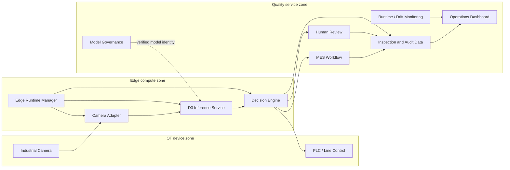

# System Architecture

## Context

The platform separates acquisition, model evidence, quality policy, industrial execution, human authority, and governance. This prevents a model response from being mistaken for a physical action or a final quality disposition.

## Responsibility boundaries

| Boundary | Owns | Does not own |
|---|---|---|
| Camera adapter | Trigger, capture, frame identity, health | Model score or quality decision |
| D3 inference | Image score, localization evidence, lineage | PLC commands or operator decision |
| Decision engine | PASS / REJECT / HOLD policy | Model training or artifact mutation |
| PLC/MES adapters | Idempotent execution and workflow state | Reinterpretation of AI evidence |
| Human review | Confirm, false-alarm, or recheck outcome | Overwriting the original AI record |
| Monitoring | Resource and feature-distribution evidence | Automatic tuning or retraining |
| Governance | Artifact identity, lifecycle, approval, rollback | Artifact generation or model editing |

## Safety invariants

1. A missing, malformed, non-finite, mismatched, or unavailable result cannot become PASS.
2. D3 image scoring and R-L3 localization are isolated; a heatmap cannot change image score or threshold.
3. Every PLC command has a deterministic command ID so a retry cannot cause a second physical action.
4. Human decisions append audit evidence; they do not replace the model observation.
5. Dashboard and monitoring paths are read-only with respect to model artifacts and industrial policy.

## Traceability keys

The event contract carries `trace_id`, `inspection/event_id`, `product_id`, `batch_id`, `camera_id`, `model_version`, `artifact_version`, AI scores, decision/reason, PLC state, MES state, operator state, and timestamp. These fields allow an inspection to be reconstructed across service boundaries.

## Evidence

- [D3 release architecture](../release/system-architecture.md)
- [Industrial closed-loop design](../industrial-closed-loop-design.md)
- [Industrial deployment architecture](../industrial-deployment/system-deployment-architecture.md)
- [Engineering decisions](../engineering-decisions.md)
