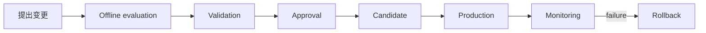

# 工业 AI 变更管理

## 1. 标准流程

任何现场直接替换模型、权重、whitening、bank、threshold、feature extractor 或 production candidate manifest 的行为均被禁止。

## 2. 变更单最小字段

- 业务原因、范围、风险、负责人和回滚负责人。
- 代码/配置版本、模型版本、artifact URI 与 SHA-256。
- 离线评估方案、数据版本、既有 metrics 对比和验收证据。
- 安全、PLC/MES、SLA、容量和追溯影响。
- 审批人、计划窗口、验证步骤、停止条件和回滚目标。

## 3. 状态门禁

- Development → Validated：artifact 存在且 hash 匹配，必需 metrics 完整，离线验证通过。
- Validated → Candidate：验证和发布审批均有证据。
- Candidate → Production：再次验证 artifact/hash/metrics，并完成现场验收与回滚准备。
- Monitoring → Rollback：出现明确失败条件时恢复上一已验证版本；目标 hash 必须重新校验。

缺文件、hash mismatch、metric missing、审批缺失或状态跳跃均 fail closed。紧急变更也不得跳过 artifact 校验和事后审计。

## 4. 职责分离

提出人不能单独批准自己的生产晋升。Model Validator 负责证据，Release Approver 负责晋升/回滚决定，Operator 负责现场确认，Auditor 只读核查完整链路。

## 5. 回滚与关闭

回滚触发包括推理持续失败、Drift Critical、控制链不一致、重大漏检风险或 artifact 校验失败。回滚完成后须确认目标版本、hash、生命周期状态、测试件结果和 PLC/MES 对账；根因、纠正措施和复发预防完成后方可关闭变更单。
