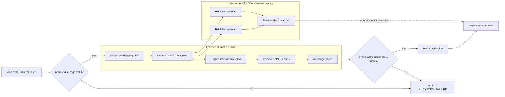

# AI Inspection Flow Diagram

The AI path uses a frozen image-scoring branch and an independent localization branch. This diagram is a presentation view of the documented [D3 adaptation](../../ai/d3-domain-adaptation.md) and [anomaly-detection pipeline](../../ai/anomaly-detection.md); it does not define a new model or operating point.

## Invariants

1. Input or identity failure cannot become PASS.
2. The D3 score and frozen threshold determine image-level policy evidence.
3. R-L3 localization provides a heatmap but cannot change the D3 image score or threshold.
4. The output retains model version, artifact version, score, reason, latency, and trace identity.

Measured capability and limitations remain in the [v1.0.0 release notes](../../release/v1.0.0-release-notes.md).
