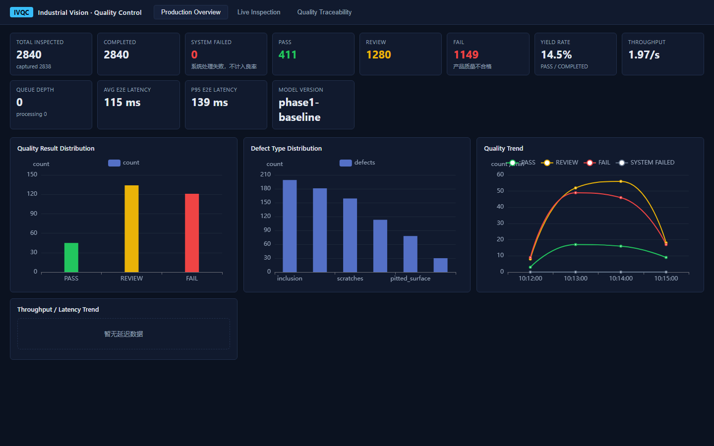
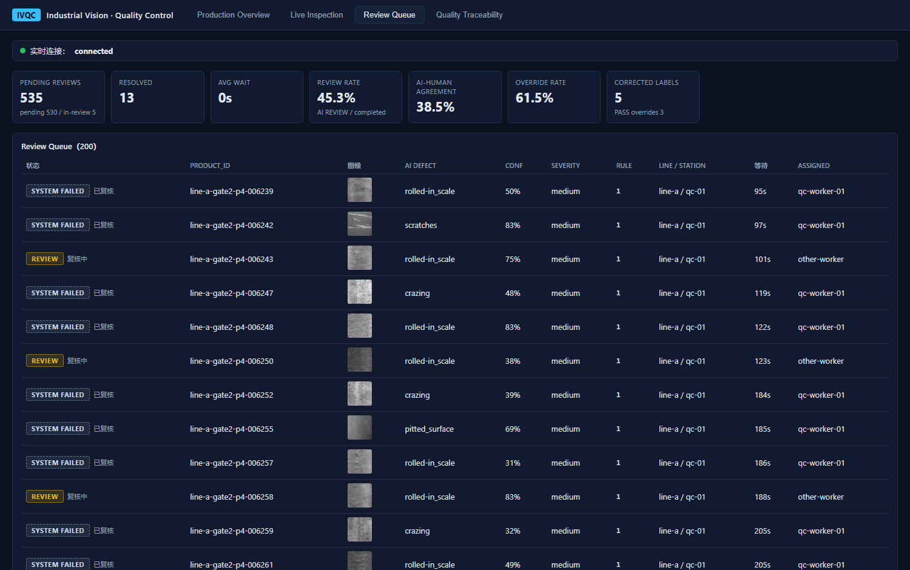
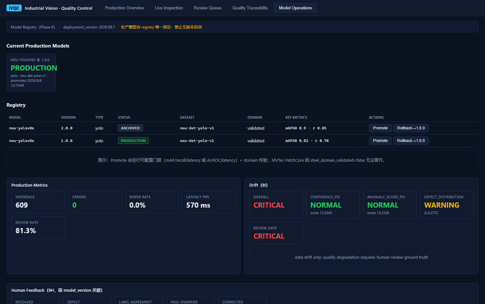
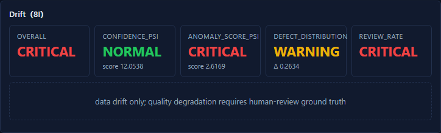

# Dashboard Showcase

The images below are committed screenshots of this repository's React dashboard running against deterministic demo seeds and simulator-backed services. They are software-interface evidence, not photographs of a physical production line or proof of a live factory deployment.

Some screens intentionally preserve earlier fixture identities such as `phase1-baseline` or the YOLO model-registry example. Those labels describe the captured demo data and must not be interpreted as the deployed identity of the frozen D3 candidate.

## Production Overview

Shows seeded inspection totals, PASS/REVIEW/FAIL distribution, queue state, latency, throughput, defect categories, and time trends. The numbers are demo-state observations, not production KPIs.

## Live Inspection

Shows WebSocket connection state, recent inspections, trace identities, line/station fields, decisions, latency, and the fixture model label. It demonstrates the UI contract rather than a physical camera feed.

## Human Review Queue

Shows pending and resolved counts, assignment, wait time, review rate, agreement/override indicators, and per-product evidence. The workflow preserves the original AI result alongside the operator disposition.

## Industrial Execution Detail

Shows one traceability record with visual evidence, product metadata, desired command, PLC acknowledgement/state, latency, MES synchronization state, and reason code. The PLC and MES fields come from the project's simulated adapter paths.

## Model Operations and Drift

Shows registry status, configurable promotion gates, operational metrics, human-feedback summaries, and drift state. The captured registry uses a YOLO fixture and demonstrates governance UI behavior; it is not a claim that D3 was promoted to production.

Shows separate confidence, anomaly-score, defect-distribution, and review-rate indicators. The UI explicitly distinguishes data drift from confirmed quality degradation, which requires human-review ground truth.

## What the Screenshots Demonstrate

- Shared inspection identity across live status, traceability, review, PLC/MES, and monitoring views.
- Visible failure and pending states instead of optimistic success.
- Separation of AI evidence, industrial execution, human disposition, and governance state.
- A functioning project dashboard over deterministic, reproducible simulator data.

They do not demonstrate physical camera timing, real PLC actuation, plant-network reliability, production throughput, production authorization, or financial return.
