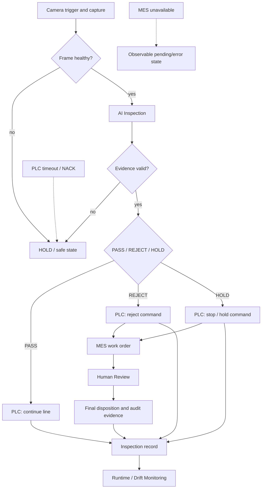

# Industrial Closed-Loop Diagram

This diagram presents the simulator-backed industrial workflow. PLC, MES, and review integrations are separate idempotent adapters in the implementation; the arrows show the inspection narrative and evidence reconciliation, not a claim that MES is physically downstream of the PLC network.

## Safety and Traceability

- A deterministic command ID prevents retries from duplicating PLC actions.
- MES work orders are idempotent by inspection/event identity.
- Communication uncertainty remains HOLD or an explicit pending/error state.
- Human review appends a disposition without overwriting the AI observation.
- Monitoring produces alerts and lifecycle evidence; it does not retrain or tune the model.

See the [PLC/MES loop](../../industrial/plc-mes-loop.md) and [protocol adaptation](../../industrial/protocol-adaptation.md) for implementation boundaries.
