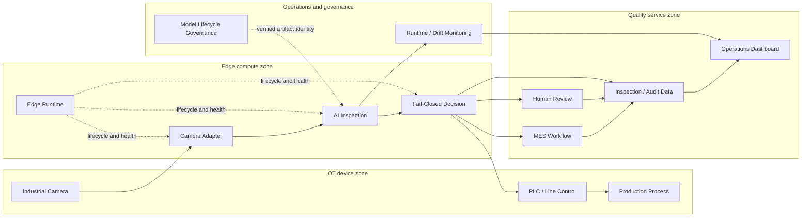

# System Architecture Diagram

This portfolio view condenses the canonical [system architecture](../../architecture/system-architecture.md). It preserves the separation between OT devices, edge inference, quality services, monitoring, and model governance.

## Reading Guide

- The camera adapter owns acquisition identity and health, not quality decisions.
- AI inspection produces evidence; the decision engine owns PASS, REJECT, and HOLD policy.
- PLC, MES, and human review preserve distinct execution and disposition states.
- Monitoring observes runtime and feature distributions but cannot mutate or promote a model.
- Governance supplies verified model identity and lifecycle evidence; artifacts remain externally managed and read-only.

Detailed deployment boundaries are available in the [deployment architecture](../../architecture/deployment-architecture.md).
