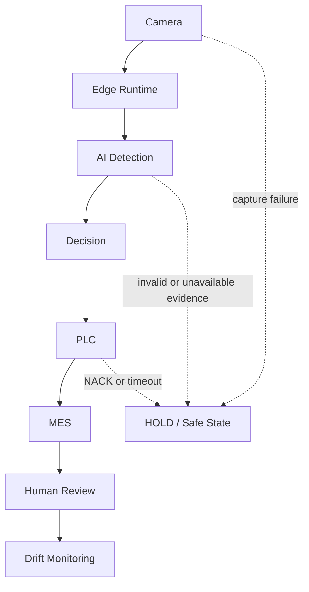
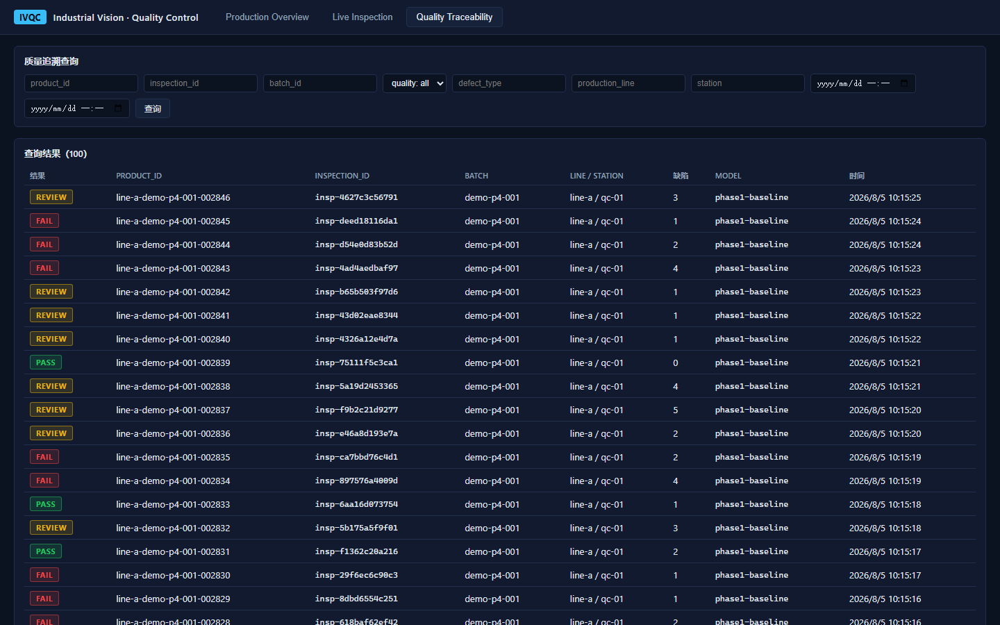
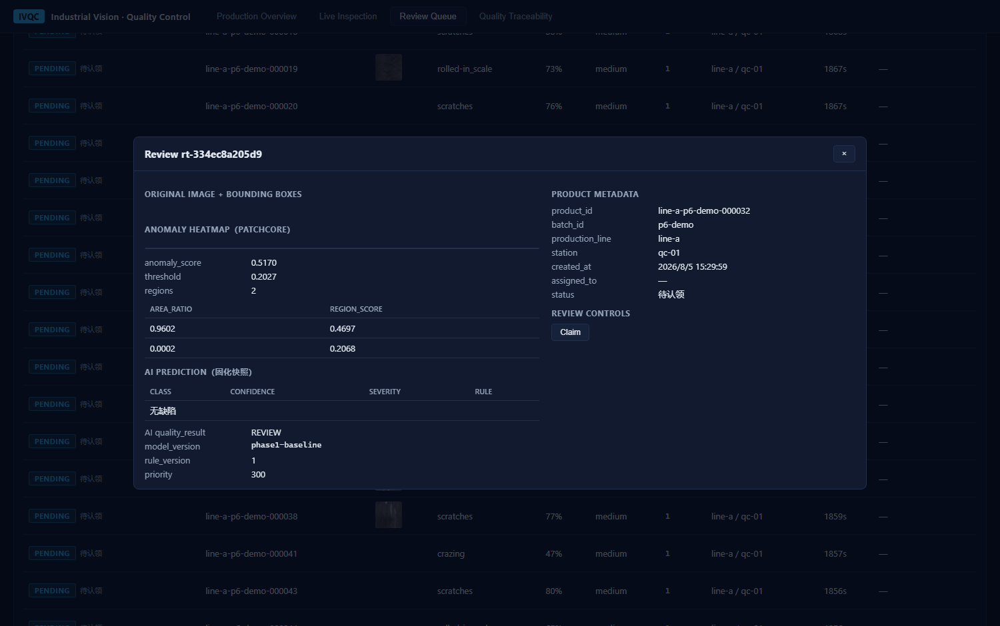

# Demo Showcase

This showcase follows one inspection through the complete industrial quality loop. It can be used as a repository walkthrough with committed screenshots or as a deterministic simulator demonstration. The simulator path exercises orchestration and failure semantics without changing the frozen D3 model or artifacts.

## End-to-End Flow



The linear presentation is intentional for a demo. In the runtime architecture, the decision engine writes PLC, MES, and review effects through separate idempotent adapters, while monitoring consumes observation data without controlling the model.

## Walkthrough

| Stage | What to demonstrate | Evidence to inspect |
|---|---|---|
| Camera | Deterministic trigger and frame identity; health accompanies every capture | `camera_id`, `frame_id`, `trigger_id`, capture latency, health |
| Edge Runtime | Dependency startup, readiness, resource telemetry, and safe shutdown | lifecycle state, readiness reason, CPU/GPU/memory telemetry |
| AI Detection | Frozen image-level anomaly score plus independent pixel localization | model/artifact identity, score, heatmap, inference latency |
| Decision | Policy maps valid evidence to PASS, REJECT, or HOLD | decision, reason code, threshold identity, trace ID |
| PLC | Idempotent line action; retries do not duplicate reject or stop commands | command ID, acknowledgement, terminal state |
| MES | Idempotent inspection/work-order synchronization | event ID, work-order state, retry history |
| Human Review | Operator claims the item, inspects evidence, and appends a disposition | reviewer, decision, reason, timestamp, original AI evidence |
| Drift Monitoring | Runtime and feature statistics become alerts and governance evidence | window, sample count, drift score, alert state, model identity |

## Decision Scenarios

1. Healthy camera and valid score below the frozen operating point produce `PASS`; the inspection remains traceable and the line continues.
2. Valid anomalous evidence produces `REJECT`; the PLC reject command and MES work order share the inspection trace.
3. Missing frames, invalid scores, identity mismatch, inference failure, or field uncertainty produce `HOLD`; no fallback silently converts uncertainty into `PASS`.
4. Human review records confirm-defect, false-alarm, or recheck evidence without rewriting the AI result.
5. Monitoring associates operational and feature drift with the same model/artifact lineage; it alerts but never retrains or promotes automatically.

## Safe Simulator Run

From the repository root, run the synthetic factory backend in an isolated Python environment:

```powershell
.\.venv\Scripts\python.exe -m industrial_loop.factory_simulator --products 1000 --seed 42 --backend synthetic
```

The command generates a deterministic camera feed when no dataset directory is supplied and writes a simulation report under the runtime output area. It does not load, edit, or retrain D3. The `live` backend is a separate integration gate and should only be used with explicitly provisioned services and artifacts.

## Visual Tour

### Inspection and traceability




### Human review and anomaly evidence




### Industrial and lifecycle operations


## Demo Acceptance Checklist

- Every stage preserves a common trace or inspection identity.
- AI evidence, policy decision, PLC state, MES state, and human disposition remain separate fields.
- A repeated PLC or MES request does not create a duplicate effect.
- At least one injected acquisition or field failure reaches `HOLD`.
- Drift evidence names the observed model and window but triggers no artifact mutation.
- The demo is described as simulator-backed and not as a physical-site acceptance result.

For deeper evidence, see the [system architecture](../architecture/system-architecture.md), [camera integration](../industrial/camera-integration.md), [PLC/MES loop](../industrial/plc-mes-loop.md), and [drift monitoring](../industrial/drift-monitoring.md).
