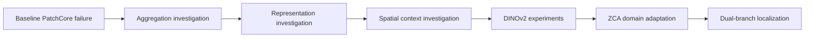

# Failure Analysis and Technical Evolution

This record explains how the steel anomaly-detection path evolved from a failed PatchCore baseline to the frozen D3 dual-branch candidate. Every numeric observation is taken from a committed report. A historical failure remains a failure; later work does not rewrite its verdict.

## 1. Baseline PatchCore Failure

| Dimension | Record |
|---|---|
| Problem | The frozen WideResNet-50-2 PatchCore baseline produced no useful image-level anomaly decisions on the formal steel split. |
| Hypothesis | The max-over-patches image aggregation or frozen threshold might be hiding useful local evidence. |
| Experiment | Audit the completed checkpoint without re-running inference; compare image ordering, confusion counts, local metrics, score distributions, and defect size. |
| Observed | On 591 normal and 6,666 anomaly images, image AUROC was `0.4817`; TP/TN/FP/FN were `0/590/1/6666`; anomaly recall was `0.0`. The anomaly median score `0.358937` was below the normal median `0.368732`. Mean per-anomaly-image Pixel AUROC and AUPRO were `0.8319` and `0.5838`, so local signal existed even though image ranking failed. |
| Decision | Keep the failure as evidence and investigate ranking before touching the frozen threshold. Do not register the baseline as a candidate. |
| Future | Any new baseline comparison must use a predeclared split and gate; it cannot reinterpret this frozen checkpoint. |

Source: [steel-domain PatchCore failure analysis](../steel-patchcore-failure-analysis.md).

## 2. Aggregation Investigation

| Dimension | Record |
|---|---|
| Problem | A global maximum may overreact to isolated normal texture and underrepresent distributed defects. |
| Hypothesis | Percentile or top-k aggregation could recover image ranking without changing features or the memory bank. |
| Experiment | Evaluate frozen A0 plus A1–A6 percentile/top-k candidates on 590 validation-normal and 3,333 recovery-development anomaly images; retain train-only thresholds and sealed holdout isolation. |
| Observed | A0–A6 image AUROC ranged from `0.4884` to `0.5007`; the best result was A3 at `0.5007`. Every candidate had anomaly recall `0.0000`, and every anomaly median remained below its normal median. Holdout access count remained `0`. |
| Decision | Reject aggregation as the dominant root fix. Preserve A0 and move the investigation upstream to feature representation. |
| Future | Alternative aggregation is only meaningful after a representation demonstrates valid ordering; it must not be used to disguise near-chance features. |

Source: [aggregation development report](../steel-patchcore-recovery-aggregation-results.md).

## 3. Representation Investigation

| Dimension | Record |
|---|---|
| Problem | The WideResNet layer2/layer3 concatenation might dilute useful features or have an avoidable normalization mismatch. |
| Hypothesis | Layer selection or per-layer normalization could materially improve normal/anomaly separation. |
| Experiment | Compare R0 layer2+layer3, R1 layer2, R2 layer3, and N0–N2 normalization variants on the same frozen diagnostic subset. |
| Observed | R0/R1/R2 image AUROC was `0.4927/0.4236/0.5388`; N2 reached only `0.4997`, a `+0.0071` change from N0. R2 improved large-defect Q4 AUROC to `0.7404`, but no feature-layer candidate reached `0.60`. Normal-manifold coverage showed only a `+0.0013` validation-versus-train median patch-distance gap. |
| Decision | Reject simple layer selection and normalization as sufficient recovery. Deprioritize bank coverage as the immediate cause, without claiming it is irrelevant. |
| Future | Revisit sampling only under a separate controlled protocol; do not enlarge or replace the frozen bank opportunistically. |

Source: [representation investigation report](../steel-patchcore-representation-results.md).

## 4. Spatial Context Investigation

| Dimension | Record |
|---|---|
| Problem | Thin steel defects may need local context or a different feature grid even when they are not sub-cell. |
| Hypothesis | Average-pooled local context or a finer layer2 grid could recover small-defect separation. |
| Experiment | Compare S0 layer3, S1 layer3+3x3 context, S2 layer3+5x5 context, and P1 layer2+3x3 context under the frozen diagnostic protocol. |
| Observed | S0/S1/S2 image AUROC was `0.5388/0.5620/0.6029`; S2 improved `+0.0641` but failed the `0.65` gate. P1 reached `0.4882`. S2 Q1/Q4 AUROC was `0.4790/0.7876`; context helped directionally but did not remove the defect-size gradient. |
| Decision | Record local context as a real but insufficient lever. Conclude that the ImageNet WideResNet feature family still lacks steel-domain validity under tested variants. |
| Future | Multi-scale or learned context requires a new authorized experiment; it is not inferred from the failed fixed pooling variants. |

Source: [spatial representation report](../steel-patchcore-spatial-context-results.md).

## 5. DINOv2 Experiments

| Dimension | Record |
|---|---|
| Problem | The controlled WideResNet reference topped out at `0.6029`, below the image-validity gate. |
| Hypothesis | Frozen self-supervised transformer patch tokens may encode steel texture and defect structure better than ImageNet convolutional features. |
| Experiment | Compare D0 WideResNet S2, D1 DINOv2 ViT-S/14, and D2 DINOv2 ViT-B/14 with the same nearest-neighbor/A0 objective before domain adaptation. |
| Observed | D0/D1/D2 image AUROC was `0.6029/0.6699/0.6938`. D1/D2 Q1 AUROC was `0.5843/0.6043`. DINOv2 improved ordering, and the larger backbone helped, but D2 remained below the `0.75` adaptation gate. |
| Decision | Select frozen DINOv2 ViT-B/14 as the representation foundation, not as a complete solution. Continue with train-normal metric-geometry adaptation rather than supervised fine-tuning. |
| Future | New backbone comparisons require an isolated candidate protocol and qualified edge-cost measurement; no superiority beyond the recorded candidates is claimed. |

Source: [domain-adaptation results](../steel-patchcore-domain-adaptation-results.md).

## 6. ZCA Domain Adaptation

| Dimension | Record |
|---|---|
| Problem | Unwhitened DINOv2-B improved ordering but remained at image AUROC `0.6938`. |
| Hypothesis | High-variance normal steel directions distort cosine nearest-neighbor geometry; train-normal covariance whitening can align the metric without updating backbone weights. |
| Experiment | Estimate regularized ZCA from train-normal DINOv2-B patch tokens, apply per-patch L2 normalization and cosine 1-NN, then confirm at full development scale and once on the sealed recovery holdout. |
| Observed | Diagnostic D3 reached image AUROC `0.8208`, `+0.1270` over D2, with Q1 `0.7341`. Full development reached `0.8362`; the sealed recovery holdout reached `0.8179071714`. |
| Decision | Freeze D3 as DINOv2-B + train-normal ZCA + cosine 1-NN + A0. Treat ZCA as a hashed, dataset-specific artifact, not an online transform to recompute silently. |
| Future | New-site adaptation requires a new dataset protocol, independent evidence, and a new governed candidate; the current ZCA artifact remains immutable. |

Sources: [domain-adaptation results](../steel-patchcore-domain-adaptation-results.md), [full-development confirmation](../steel-patchcore-d3-full-development-results.md), [sealed holdout report](../steel-patchcore-d3-recovery-holdout-results.md), and [machine-readable holdout evidence](../steel-patchcore-d3-recovery-holdout-results.json).

## 7. Dual-Branch Localization

| Dimension | Record |
|---|---|
| Problem | The valid D3 image branch did not provide acceptable defect localization. The best permitted H0–H5 heatmap post-processing candidate reached only Pixel AUROC `0.656437` and AUPRO `0.336327`. |
| Hypothesis | Image ranking and pixel localization require different representations; a localization-specific branch can improve heatmaps while leaving D3 scores immutable. |
| Experiment | Evaluate R-L1–R-L4 as standalone image scorers and as independent pixel branches paired with the frozen D3 image branch. |
| Observed | R-L3 standalone image AUROC was `0.661694`, below the image gate, while its Pixel AUROC and AUPRO were `0.924139` and `0.799398`. The integrated D3 image AUROC remained `0.817907171428`, with `0` per-image score mismatches and unchanged candidate artifacts. |
| Decision | Keep D3-ZCA A0 as the sole image-score branch and select R-L3 only for localization evidence. Enforce branch isolation through score-invariance tests and separate hashes. |
| Future | Localization can evolve only behind the same immutability contract; a new heatmap branch must not change the frozen image score or threshold. |

Sources: [heatmap root-cause report](../d3-heatmap-root-cause.md), [localization investigation](../d3-localization-representation-investigation.md), and [dual-branch evaluation](../dual-branch-evaluation-report.md).

## Final Engineering Lesson

The recovery succeeded by changing the feature geometry, not by tuning the threshold or polishing the score aggregation. The final system also avoided forcing one representation to optimize two different objectives: D3 owns image ordering, and R-L3 owns localization. This conclusion is limited to the committed steel protocol and does not establish cross-site generalization.
