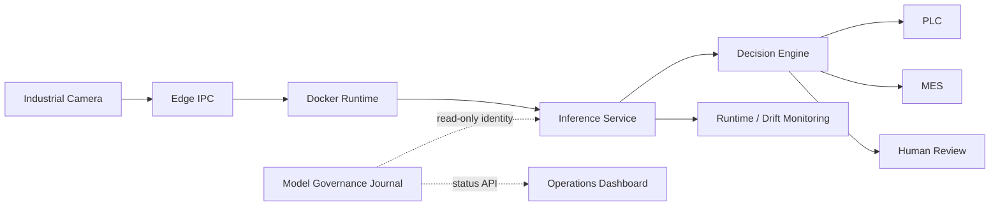

# 工业部署架构

## 1. 逻辑架构

D3 推理资产是冻结输入。新增治理层只管理 artifact 引用、SHA-256、状态和审批记录，不改变模型文件或推理参数。

## 2. 数据流

1. Camera Adapter 生成带 `camera_id`、采集时间和帧标识的图像事件。
2. Edge IPC 的受控队列将帧交给容器化 Inference Service。
3. Inference Service 输出冻结 D3 image score、localization evidence 和 model lineage。
4. Decision Engine 将有效结果映射为 PASS/REJECT；任何输入、推理或契约异常映射为 HOLD。
5. 检测事件写入 MES/复核队列与监控，Dashboard 仅查询，不参与控制判定。

图像与业务元数据分开保存；跨边界只传最小必要字段和受控图像引用。日志不得包含凭据或未脱敏个人信息。

## 3. 控制流

- PASS：PLC 放行，MES 记录通过。
- REJECT：PLC 执行剔除/隔离，MES 创建质量工单，必要时进入人工复核。
- HOLD：PLC 停止或保持当前件，禁止自动放行，人工确认恢复条件。
- 生命周期晋升：Validation → Approval → Candidate → Production，全部由治理接口验证并记录。
- 回滚：工程师选择已登记版本，系统重新校验 artifact/hash/metrics 后恢复，并记录原因。

## 4. 网络边界

| 区域 | 组件 | 允许流向 |
|---|---|---|
| OT 设备区 | Camera、PLC | 仅到 Edge IPC 指定端口；默认拒绝入站 |
| Edge 计算区 | Docker Runtime、Inference、Decision | 接收相机数据；向 PLC/MES 发受控请求 |
| 服务区 | MES adapter、Review、Dashboard、Governance | 接收 Edge 事件；Dashboard 只读 |
| 管理区 | 运维终端、制品库 | 经审批访问服务区；不得直连 Camera |

边界使用防火墙允许列表、TLS/设备网络隔离和集中审计。PLC 通道不能被 Dashboard 或普通用户直接调用。

## 5. 权限

| 角色 | 权限 |
|---|---|
| Operator | 查看状态、处理人工复核、确认 HOLD |
| Maintenance Engineer | 查看日志、健康检查、执行批准的服务恢复 |
| Model Validator | 登记与验证版本，不得直接生产晋升 |
| Release Approver | 批准 Candidate/Production、执行回滚 |
| Auditor | 只读访问 manifest、hash、历史和操作日志 |

## 6. 故障策略

| 故障 | 自动行为 | 恢复条件 |
|---|---|---|
| Camera 断连/帧损坏 | 当前件 HOLD，停止消费坏帧 | 相机健康检查通过并人工确认 |
| Inference 超时/异常 | HOLD，不复用旧结果 | 服务健康、artifact 校验和试运行通过 |
| artifact 缺失/hash mismatch | 拒绝启动或晋升 | 恢复已批准 artifact 并重新校验 |
| PLC 不可达/确认超时 | HOLD，禁止假定执行成功 | 通讯恢复且命令状态对账完成 |
| MES 不可达 | 本地持久化待发送事件，不丢弃追溯 | 重放成功并去重 |
| Drift Warning | 继续生产并提高观察/复核 | 连续窗口恢复正常或完成调查 |
| Drift Critical | HOLD | 质量与发布负责人批准恢复或回滚 |
