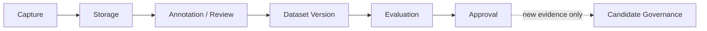

# Industrial Vision Data Management

Industrial validation depends on controlled data identity as much as model identity. This lifecycle describes how images and evidence move from capture to approval without implying that production data collection is already operating.

## 1. Capture

### Implemented capability

The camera contract records frame, camera, trigger, sequence, timestamp, dimensions, latency, status, and error identity. A failed capture cannot reuse a previous successful image.

### Simulation

The virtual camera replays deterministic files and supports seeded failure injection. Simulator events exercise product/inspection traceability but are not physical camera evidence.

### Future deployment

Define product-to-trigger association, capture sampling, clock synchronization, image completeness, exposure/lighting metadata, privacy, ownership, consent where applicable, and outage buffering. Validate lost, duplicate, late, corrupt, and mis-associated frames on the actual line.

## 2. Storage

### Implemented capability

The full backend uses PostgreSQL as the structured source of truth; WebSocket is notification only. Inspection events retain AI, PLC/MES, review, lineage, and timestamp fields. Datasets, runtime databases, images, weights, banks, caches, and generated artifacts are intentionally excluded from Git.

### Simulation

The closed-loop simulator can use a thread-safe event store, and demo seeds populate reproducible dashboard state. This does not validate plant retention or storage capacity.

### Future deployment

Select approved image/object storage and database services; define encryption, access, retention, legal hold, backup/restore, capacity, deletion, data residency, audit, and disaster recovery. Store immutable raw captures separately from derived thumbnails, heatmaps, annotations, and exports.

## 3. Annotation and Human Review

### Implemented capability

The review workflow records operator identity, claim/resolution state, disposition, reason, timestamp, and original AI evidence. FAT feedback supports operator review, false positive, and false negative records with automatic retraining disabled.

### Simulation

Seeded review records exercise confirm, false-alarm, and recheck paths. They demonstrate workflow semantics, not label quality from factory experts.

### Future deployment

Approve defect taxonomy, mask/box/image-level rules, annotator qualifications, double review/adjudication, ambiguous/ignore labels, sampling of PASS items, and reviewer-agreement checks. Preserve corrections as append-only evidence and protect personal/operator data.

## 4. Dataset Version

### Implemented capability

Committed manifests separate train-normal, validation/development, sealed holdout, and recovery roles; checks cover membership, overlap, duplicates, unexpected IDs, hashes, and lineage. Model, dataset, artifact, and deployment versions remain separate identities.

### Simulation

Repository splits and manifests provide reproducible steel-domain evidence. They describe the committed dataset protocol, not a new mill, camera, illumination setup, or material distribution.

### Future deployment

Create a site dataset manifest with source system, collection window, product/material scope, camera/lighting configuration, annotation version, role assignment, item hashes, exclusion reasons, lineage, owner, and approval. A changed distribution creates a new dataset version; it does not overwrite history.

## 5. Evaluation

### Implemented capability

Evaluation reports image AUROC, Pixel AUROC, AUPRO, confusion/operating-point evidence, score distributions, defect-size quartiles, robustness, and immutable model/artifact identity. Holdout access is controlled and auditable.

### Simulation

Fault injection and virtual industrial tests validate orchestration, idempotency, fail-closed behavior, monitoring, and rollback separately from model accuracy.

### Future deployment

Pre-register site metrics, gates, exclusions, confidence intervals, cost/error policy, subgroup slices, and sealed evaluation procedure. Keep development and site acceptance roles isolated, and investigate failures without relabeling or tuning the frozen release after the fact.

## 6. Approval and Retention

### Implemented capability

Candidate registration binds dataset/evaluation evidence and artifact hashes. Promotion and rollback are explicit lifecycle actions; feedback and drift never trigger automatic training or promotion.

### Simulation

Readiness, FAT, lifecycle, and rollback drills demonstrate governance behavior while retaining `production_promotion=false` where applicable.

### Future deployment

Require named data, quality, engineering, cybersecurity, and plant approvers. Preserve the exact approval package, limitations, deviations, retention period, rollback target, and supersession reason. Production approval must not be inferred from repository visibility or simulator PASS results.

Related documents: [data flow](../architecture/data-flow.md), [validation strategy](validation-strategy.md), [human-review workflow](../d3-human-review-workflow.md), and [engineering decisions](../engineering-decisions/architecture-decisions.md).
