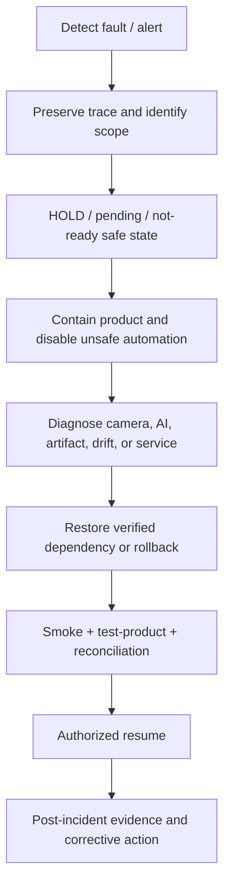

# Incident Response

This guide maps known platform failures to safe software behavior and a future site response process. It does not claim that these incidents occurred on a physical production line.

## Incident Boundary

### Implemented capability

Reason-coded failures, readiness/degraded states, HOLD/pending behavior, trace identities, immutable AI evidence, idempotent PLC/MES operations, drift alerts, artifact verification, and rollback are available in the project.

### Simulation

Tests and fault injection cover camera/capture errors, inference failure, malformed/non-finite results, artifact mismatch, PLC/MES failure, drift states, service readiness, and rollback behavior through virtual or simulator-backed components.

### Future deployment

The site must define incident severity, alarm routing, response time, command authority, manual inspection, product quarantine, safety-system interaction, communication, vendor support, evidence retention, regulatory/customer reporting, and resume approval. No site RTO/RPO is claimed here.

## Camera Failure

### Implemented capability

Disconnected/offline camera, capture error, unhealthy frame, stopped line, or invalid frame cannot reuse the previous image and maps to failure evidence/HOLD.

### Simulation

The virtual camera supports deterministic failure injection, and camera/inference pipeline tests verify fail-closed behavior.

### Future deployment response

Hold and identify affected product; check power, trigger, link, packet/USB status, lens/window, lighting, exposure, temperature, mount, timestamp, and vendor logs. After repair, require health, a valid test frame, product/trigger association, and the approved test-product chain before authorized resume.

## AI Failure

### Implemented capability

Inference timeout, exception, unavailable service, invalid/missing/non-finite fields, smoke failure, or identity mismatch produces HOLD/not-ready rather than PASS. Previous scores are not reused.

### Simulation

Fault tests cover inference unavailable/timeout and contract failures; FAT maps inference timeout to REVIEW_REQUIRED/HOLD.

### Future deployment response

Contain current and potentially affected product; capture request/trace ID; inspect runtime readiness, GPU/CPU/memory, dependencies, input contract, logs, and last approved change. Restore the verified service or execute approved rollback, then run smoke, known test products, PLC/MES reconciliation, and quality-owner approval.

## Artifact Mismatch

### Implemented capability

Missing or mismatched weights, whitening, bank, manifest, evidence, shape, or finite-value checks block registration/load/readiness. Arrays are read-only, and rollback hash mismatch leaves state unchanged.

### Simulation

Candidate registry and rollback drills inject hash mismatch and verify fail-closed blocking without modifying the artifact.

### Future deployment response

Stop intake or keep the line in the site-approved safe/manual state. Preserve the unexpected file and audit evidence, identify provenance and access history, restore the exact approved package from the controlled registry/backup, verify every hash, and investigate unauthorized or corrupt change. Never edit a hash, threshold, bank, or manifest to force readiness.

## Drift Detection

### Implemented capability

Drift NORMAL continues, WARNING alerts and observes without tuning, and CRITICAL maps to HOLD/human investigation. Drift does not retrain, recalibrate, rebuild a bank, or change the threshold.

### Simulation

Committed scenarios cover normal frames, brightness shift, and material change; the critical scenario produced stop signals and zero PASS after critical in simulation.

### Future deployment response

Determine whether the cause is camera/lighting, material/supplier, process, cleaning/maintenance, configuration, timestamp/data quality, or genuine defect change. Increase approved sampling/review, contain affected product as required, and compare ground truth. Resume only under the site drift-recovery rule; a new distribution may require a new dataset and candidate rather than an in-place update.

## Service Outage

### Implemented capability

Runtime health/readiness exposes service failure; inference outage fails requests safely, PLC uncertainty holds product, MES failure preserves an idempotent replayable event, PostgreSQL failure removes readiness, and WebSocket loss does not erase persisted state.

### Simulation

Unit/integration/fault-injection paths exercise unavailable inference, PLC timeout/NACK/offline, MES error/timeout, database unavailability, and dashboard reconnect semantics with non-production services.

### Future deployment response

Identify dependency scope and last successful trace; activate manual inspection/product containment; prevent duplicate commands; restore services in the approved order; reconcile database, PLC, MES, review queue, and held products; validate health and a test-product chain; obtain authorized resume. Do not assume a command executed or a MES event synchronized without its expected acknowledgement.

## Recovery and Closure Checklist

1. Preserve timestamps, trace/request/product IDs, logs, alarms, screenshots, configuration and manifest identities, hashes, and operator actions.
2. Confirm safe state and product containment before diagnosis.
3. Restore only approved dependencies or execute the approved rollback; no emergency threshold/model edits.
4. Verify runtime readiness, artifact identity, smoke inference, test product, PLC/MES idempotency/reconciliation, review queue, monitoring, and drift.
5. Record affected scope, root cause, correction, residual risk, approvals, and follow-up owner.
6. Resume only through the designated site authority; repository tests cannot authorize plant restart.

Related documents: [failure scenarios](../failure-recovery.md), [operation manual](../operations/operation-manual.md), [rollback guide](../operations/rollback-guide.md), [drift monitoring](../industrial/drift-monitoring.md), and [maintenance plan](maintenance-plan.md).
