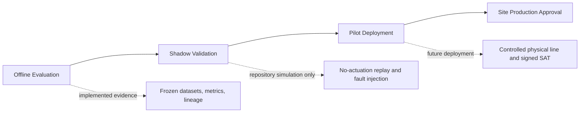

# Industrial Validation Strategy

This strategy separates model evidence from factory evidence. The repository has completed offline evaluation and simulator-backed operational qualification, but it has not executed a physical-line shadow validation, pilot deployment, or site acceptance test.

## Validation Principles

1. Each phase has a different claim boundary: offline model validity, shadow system behavior, pilot operational fitness, then site authority.
2. Passing one phase does not automatically authorize the next.
3. Model, artifact, threshold, deployment configuration, hardware, dataset, and protocol identities remain independently traceable.
4. A failed gate is terminal evidence for that candidate; it is not repaired by changing the report or threshold.
5. Physical plant safety and release authority remain outside the AI model.

## Phase 1: Offline Evaluation

### Implemented capability

- Frozen train-normal, development, and sealed recovery roles with manifest and overlap checks.
- Image AUROC, Pixel AUROC, AUPRO, score-distribution, quartile, robustness, and reproducibility evidence.
- Candidate registry, release/candidate manifests, artifact SHA-256 checks, immutable threshold, and dual-branch score-invariance tests.
- Current sealed evidence: image AUROC `0.817907171428`, Pixel AUROC `0.924139`, and AUPRO `0.799398`.

### Simulation

The deterministic repository tests replay known inputs, malformed inputs, artifact/identity errors, and localization integration. This verifies software contracts; it does not reproduce a site's optics, product mix, camera timing, or process variation.

### Future deployment

- Define a site dataset protocol before collection, including product families, shifts, speeds, materials, lighting states, maintenance conditions, defect taxonomy, and reviewer rules.
- Seal site acceptance data from candidate development and approve site-specific metric and operating-point gates.
- Reconfirm calibration, false-positive/false-negative cost, and cross-condition performance without altering the released candidate in place.

Evidence: [dual-branch evaluation](../dual-branch-evaluation-report.md), [sealed holdout report](../steel-patchcore-d3-recovery-holdout-results.md), and [test matrix](../test-matrix.md).

## Phase 2: Shadow Validation

### Implemented capability

- Traceable camera, inference, decision, PLC/MES, review, monitoring, and rollback contracts.
- Read-only/no-promotion candidate mode, fail-closed decisions, idempotent command IDs, and persisted prediction/evidence identity.
- An earlier candidate shadow exercise recorded 3,924 predictions with `0` errors, while correctly failing its heatmap acceptance gate. That historical failure was followed by separately evaluated dual-branch localization.

### Simulation

- Virtual camera and simulator-backed PLC/MES services exercise end-to-end behavior without a physical line.
- Accelerated 24-hour stability evidence uses a virtual clock, 240 requests, and 12 unique images; it is explicitly not a 24-hour wall-clock soak.
- The FAT 8-hour workload is an accelerated discrete-event replay, not a physical shift or production soak.

### Future deployment

Run a no-actuation or advisory-only shadow on the target line. Bind every frame to the real product/trigger, compare AI evidence with existing inspection and reviewed ground truth, measure loss/duplication/timing, and prevent AI commands from controlling production. Exit only after signed data completeness, model, system, safety, and operator-review criteria pass.

Evidence: [operational qualification](../steel-patchcore-d3-operational-qualification-report.md), [24-hour simulation report](../d3-24h-stability-report.json), and [factory acceptance report](../d3-factory-acceptance-report.md).

## Phase 3: Pilot Deployment

### Implemented capability

The project provides edge lifecycle/health checks, fail-closed PASS/REJECT/HOLD mapping, simulator-backed PLC/MES interaction, human review, drift alerts, artifact verification, and rollback procedures. These are prerequisites, not proof of pilot completion.

### Simulation

FAT covers deterministic pipeline, throughput replay, PLC/MES idempotency, drift scenarios, feedback recording, and regression tests. `production_promotion=false` remains explicit in the evidence.

### Future deployment

- Select a bounded line, product range, shift window, and rollback target with plant approval.
- Begin with HOLD/advisory authority, then grant limited actuation only after machine-safety, PLC/MES, latency, traceability, operator, and recovery gates pass.
- Monitor product containment, human overrides, missed defects, false alarms, queue load, service health, resource envelopes, and drift.
- Stop the pilot on any unbounded safety, identity, data-loss, command-state, or rollback uncertainty.
- Production approval requires a signed site acceptance record; repository FAT cannot issue it.

## Promotion Evidence Package

Each phase should preserve the source revision, environment, hardware, camera/lighting configuration, protocol maps, dataset and split manifests, model/artifact hashes, threshold identity, metric reports, failure injections, approvals, deviations, open risks, and rollback target. Missing evidence blocks progression.

See the [site acceptance test plan](site-acceptance-test.md), [factory integration guide](../industrial/integration/factory-integration-guide.md), and [deployment guide](../operations/deployment-guide.md).
