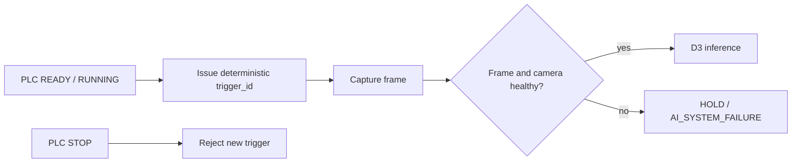

# Camera Integration

## Contract

`CameraAdapter` defines a vendor-neutral acquisition boundary:

```python
connect()
trigger(trigger_id)
capture() -> CameraFrame
health_check()
get_status()
disconnect()
```

`CameraFrame` carries frame ID, camera ID, timestamp, image path, dimensions, trigger ID, capture state, sequence number, latency, and error detail. A failed frame must carry an error; a successful frame cannot.

## Trigger and interlock flow



The virtual adapter replays files deterministically and supports seeded failure injection. A physical GigE Vision, USB3 Vision, or vendor SDK implementation can replace it through dependency injection without changing inference or decision logic.

## Fail-closed semantics

- disconnected/offline camera → HOLD;
- failed capture → HOLD;
- unhealthy camera dominates a seemingly valid frame → HOLD;
- stopped line refuses new triggers;
- the last successful frame is never reused as a substitute.

## Current boundary

The adapter and failure semantics are verified in simulation. Physical camera timing, packet loss, pixel format, exposure control, hardware trigger jitter, and SDK recovery require site acceptance.

## Trace

[Detailed camera design](../industrial-camera-adapter-design.md) · [`industrial_loop/camera/`](../../industrial_loop/camera/)
