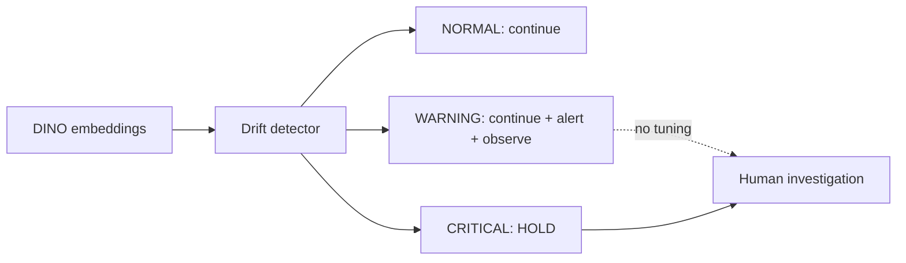

# Drift Monitoring

## Purpose

The detector watches frozen DINO feature distributions for illumination, material, lens, camera, and process shifts. It observes the model environment without changing the model.

## Signals

| Signal | Interpretation |
|---|---|
| PSI mean | Average per-dimension population shift |
| PSI max | Worst dimension, reported for diagnosis rather than verdict |
| Cosine-distribution shift | Change in feature concentration/shape |
| Standardized mean distance | RMS mean shift in baseline standard deviations |

The verdict is the worst configured signal band: NORMAL, WARNING, or CRITICAL.

## Production policy

Hard rules:

- WARNING does not alter scores or decisions.
- CRITICAL cannot produce PASS and maps to `HOLD / DATA_DISTRIBUTION_SHIFT`.
- Drift never retrains, recalibrates, rebuilds a bank, or tunes a threshold.
- Recovery is an explicit human/operational decision.

## Scenario evidence

| Scenario | State | Outcome |
|---|---|---|
| 10,000 normal frames | NORMAL | Production continues |
| brightness shift | WARNING | Alert with continued production |
| material change | CRITICAL | HOLD, eight PLC stop signals, zero PASS after critical |

## Trace

[Detailed drift design](../industrial-drift-monitoring-design.md) · [`monitoring/drift/`](../../monitoring/drift/) · [FAT drift report](../d3-fat-drift-report.json)
