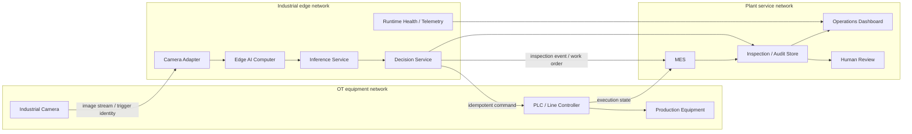

# Industrial Network Topology

This document describes a typical deployment topology for the Industrial Vision AI Quality Inspection Platform. It is a reference architecture for site planning, not evidence that a physical factory network or vendor device has already been commissioned.

## Reference Topology

The presentation path is Camera -> Edge AI Computer -> Inference Service -> PLC -> MES -> Dashboard. The implementation keeps decision policy, PLC actuation, MES synchronization, and dashboard reads as separate responsibilities. A dashboard never writes model artifacts or directly controls the PLC.

## Network Zones

| Zone | Typical components | Allowed data direction | Design intent |
|---|---|---|---|
| OT equipment | Camera, PLC, line controller, trigger I/O | Camera/PLC to allow-listed edge endpoints; bounded commands back to PLC | Keep device traffic isolated from user and enterprise networks |
| Industrial edge | Camera adapter, runtime manager, inference, decision service | Camera input; PLC/MES output; health and audit telemetry | Execute deterministic inspection close to the process |
| Plant service | MES gateway, inspection store, review API, dashboard | Authenticated event intake and read-only operational queries | Coordinate workflows without exposing OT devices to browsers |
| Management | Release workstation, artifact registry, maintenance access | Approved deployment and maintenance sessions only | Separate lifecycle authority from runtime traffic |

## Logical Interfaces

| From | To | Payload | Site decision required |
|---|---|---|---|
| Camera | Edge camera adapter | Frame, timestamp, trigger ID, device health | GigE/USB topology, SDK, pixel format, trigger mode, time synchronization |
| Edge decision service | PLC gateway | Command ID, PASS/REJECT/HOLD action, reason, timestamp | OPC UA nodes or Modbus registers, interlocks, acknowledgement handshake |
| PLC gateway | MES/event layer | Execution state and equipment acknowledgement | Ownership of final line state and reconciliation policy |
| Edge/MES | Inspection store | Trace ID, product/batch identity, AI evidence, execution state | Retention, privacy, schema ownership, offline buffering |
| Inspection store | Dashboard/review | Read-only operational and review views | Authentication, roles, audit access, plant availability target |

## Isolation and Availability Principles

1. Do not route camera or PLC networks directly to user workstations or the public internet.
2. Allow-list only required source, destination, protocol, and port combinations between zones.
3. Keep browser/dashboard access read-only with respect to PLC commands, inference configuration, and model artifacts.
4. Use plant-approved identity, certificate, credential rotation, and time-synchronization services.
5. Define bounded retries and offline queues at adapter boundaries; never hide an uncertain command or MES state as success.
6. Treat network loss, invalid acknowledgement, stale frames, and identity mismatch as explicit degraded/HOLD conditions.
7. Validate bandwidth, latency, jitter, reconnect behavior, and redundant-path failover under site load.

## Current Project Boundary

Implemented in the repository are the protocol-neutral camera contract, edge runtime lifecycle, inference/decision separation, simulator-backed PLC/MES paths, traceable review workflow, dashboard, monitoring, and fail-closed behavior. Physical switch configuration, VLAN/firewall rules, vendor camera transport, plant PLC addressing, MES authentication, redundant networking, and site cybersecurity approval are Future Integration activities.

Related documents: [deployment architecture](../../architecture/deployment-architecture.md), [camera integration](../camera-integration.md), [PLC/MES loop](../plc-mes-loop.md), and [factory integration guide](factory-integration-guide.md).
