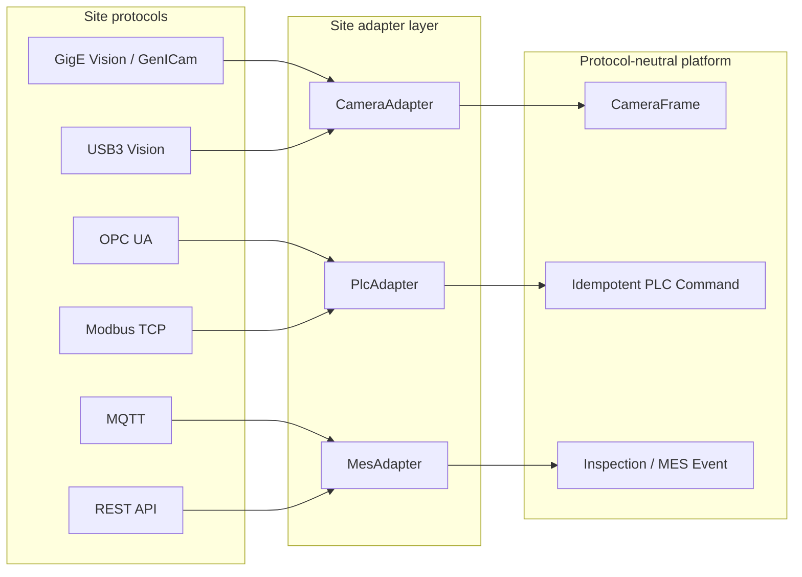

# Protocol Adaptation Guide

This guide explains how site-specific industrial protocols should terminate at the platform's adapter boundaries. It does not claim implementation or validation against any physical camera, PLC, broker, MES product, or vendor SDK.

## Adaptation Boundary

Vendor objects, transport sessions, node handles, register addresses, topics, and HTTP response types stop at the adapter layer. Inference and decision code consume only canonical frames, commands, events, health, and error states.

## Capability Status

| Protocol | Architectural role | Implemented | Future Integration |
|---|---|---|---|
| GigE Vision / GenICam | Network camera discovery, configuration, trigger, and image streaming | Vendor-neutral camera contract and virtual-file adapter | Vendor SDK/GenTL producer, device feature map, packet tuning, PTP, hardware trigger, reconnect and soak qualification |
| USB3 Vision | Direct-attached camera configuration and streaming | Same canonical camera contract and simulated failure semantics | Host library/vendor SDK, USB topology, buffer strategy, power/bandwidth validation, hardware trigger and reconnect qualification |
| OPC UA | Structured PLC command, state, and acknowledgement exchange | Simulator-backed OPC UA server/client integration gate | Plant namespace/node map, certificates, security policy, real PLC interlocks, session recovery and site acceptance |
| Modbus TCP | Coil/register command and acknowledgement exchange | Protocol-neutral PLC command contract only | Approved register map, endian/scaling rules, ownership, handshake, watchdog, physical PLC validation |
| MQTT | Asynchronous MES/event transport | Protocol-neutral inspection/MES event contract only | Broker, topic/schema governance, QoS, retained-message policy, authentication, deduplication and dead-letter handling |
| REST API | Synchronous MES/workflow integration | HTTP simulator-backed MES path | Plant endpoint/schema mapping, TLS/OAuth or site authentication, idempotency agreement, rate limits, reconciliation and availability tests |

## Camera Protocols

### GigE Vision / GenICam

A site `CameraAdapter` should translate discovery, connection, feature configuration, trigger, buffer acquisition, timestamp, and health into the canonical `CameraFrame`. The adapter owns GenICam node access and pixel conversion. It must report packet loss, incomplete frames, trigger mismatch, timestamp discontinuity, and reconnect state instead of returning a stale successful frame.

Site qualification covers link capacity, NIC ownership, packet size, resend policy, multi-camera concurrency, PTP/device clock behavior, exposure/gain persistence, trigger jitter, and vendor SDK recovery. None of these physical checks are represented by the virtual camera tests.

### USB3 Vision

The same camera contract applies, but the site adapter owns USB device enumeration, stream buffers, transfer status, host-controller affinity, SDK lifecycle, and reconnect. Qualification covers cable and hub topology, power stability, host bandwidth contention, frame completeness, trigger latency, and recovery after unplug/replug or controller reset.

For both camera protocols, disconnected, unhealthy, duplicate, late, or malformed acquisition is an explicit failure that reaches HOLD.

## PLC Protocols

### OPC UA

Map the canonical PLC command and result to an approved namespace URI and node set. Validate node data types and server identity at startup. Use deterministic command IDs, bounded writes, acknowledgement/state reads or subscriptions, and explicit timeout/NACK handling. Certificates, trust lists, user/application identity, security mode, reconnect, and namespace changes are deployment responsibilities.

The repository's OPC UA path is simulator-backed; it does not certify interoperability with a physical vendor PLC.

### Modbus TCP

Define a version-controlled site register map containing unit ID, address, function code, coil/register type, byte/word order, scaling, valid range, ownership, acknowledgement, and reset sequence. A Modbus transaction ID is not sufficient business idempotency: the PLC handshake must associate execution with the deterministic inspection command ID or an equivalent site-approved sequence.

The repository does not contain a physical Modbus TCP driver or validated PLC register map.

## MES Protocols

### MQTT

Map canonical inspection events to versioned topics and payload schemas. Define QoS, session behavior, retained messages, ordering, duplicate delivery, acknowledgement topics, offline buffering, dead-letter handling, and replay policy. Consumers deduplicate using inspection/event identity. Separate telemetry, result, acknowledgement, and command topics with least-privilege credentials.

The repository does not include a commissioned plant MQTT broker or site topic contract.

### REST API

Map the canonical event to versioned plant endpoints with explicit request and response schemas. Use a stable idempotency key, bounded timeout, authenticated TLS, response identity validation, retry policy, and reconciliation job. HTTP success alone is insufficient unless the MES acknowledges the expected inspection/event identity and state.

The implemented HTTP integration is simulator-backed; production endpoint behavior and authentication remain site-specific.

## Cross-Protocol Acceptance Rules

1. Preserve trace, inspection, product, batch, trigger, model, artifact, and command identities across translations.
2. Keep retries bounded and idempotent; surface exhausted retries and uncertain terminal states.
3. Separate adapter health from device/process health.
4. Never convert transport failure, invalid data, or uncertain acknowledgement into PASS or successful synchronization.
5. Store endpoints, credentials, certificates, node/register maps, and topics in deployment configuration or an approved secret store, not in model artifacts.
6. Test disconnect, timeout, duplicate, stale message, restart, clock drift, and partial-response scenarios at the site.

See the higher-level [industrial protocol boundary](../protocol-adaptation.md), [network topology](industrial-network-topology.md), and [factory integration guide](factory-integration-guide.md).
