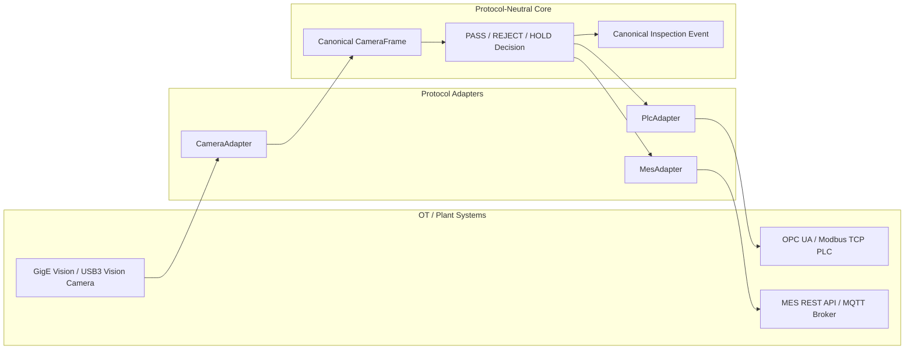

# Industrial Protocol Adaptation

This document defines architecture boundaries for connecting physical cameras, PLCs, and MES platforms. It does not add protocol drivers or change the industrial decision logic. All physical integrations require vendor qualification and site acceptance testing.

## Adapter Boundary

Protocol-specific types terminate at the adapter boundary. Vendor SDK objects, OPC UA node handles, Modbus registers, HTTP responses, and MQTT envelopes must not leak into inference or quality-policy code.

## Capability Matrix

| Integration | Protocols | Repository boundary | v1.0.0 status |
|---|---|---|---|
| Camera | GigE Vision, USB3 Vision | `CameraAdapter` -> canonical `CameraFrame` | Virtual camera implemented; physical drivers are adaptation targets |
| PLC | OPC UA, Modbus TCP | quality decision -> idempotent PLC command/result | OPC UA simulator path available; physical OPC UA and Modbus TCP require site adapters |
| MES | REST API, MQTT | inspection event -> idempotent MES acknowledgement/state | HTTP simulator path available; site REST and MQTT require system-specific adapters |

## Camera: GigE Vision and USB3 Vision

Both protocols implement the existing camera contract: connect, trigger, capture, health check, status, and disconnect. The adapter normalizes output into a `CameraFrame` with frame identity, camera identity, timestamp, trigger identity, dimensions, sequence, latency, capture state, and error detail.

### GigE Vision

The site adapter should own device discovery, GenICam feature access, packet sizing, resend policy, PTP/device timestamps, hardware-trigger configuration, pixel-format conversion, and SDK reconnection. Network design must qualify bandwidth, jumbo-frame settings where used, multicast/unicast behavior, packet loss, and multi-camera synchronization.

### USB3 Vision

The site adapter should own host-controller selection, device enumeration, stream buffers, transfer recovery, hardware triggers, device timestamps, pixel-format conversion, and SDK lifecycle. Qualification must include cable length, hub topology, host bandwidth contention, power stability, and reconnect behavior.

For either protocol, a disconnected, unhealthy, late, duplicate, or invalid frame maps to the safe `HOLD` path. A previous successful image must never be substituted for a failed current capture.

## PLC: OPC UA and Modbus TCP

The PLC adapter receives a protocol-neutral command containing inspection identity, deterministic command ID, action, timestamp, and reason. It returns acknowledgement, terminal state, retry information, and error detail without reinterpreting the AI evidence.

### OPC UA

The adapter maps commands and states to qualified namespace URIs and node identifiers, verifies data types, observes server/session health, and handles subscriptions or bounded polling. Site qualification must verify certificate trust, security policy, namespace stability, write acknowledgement, command interlocks, reconnect behavior, and duplicate suppression.

### Modbus TCP

The adapter maps the same command contract to an approved coil/register table. A deployment-specific map defines address, function code, data type, byte/word order, scaling, write ownership, acknowledgement register, and reset/handshake sequence. Transaction IDs alone are not business idempotency; the deterministic command ID and PLC handshake must prevent duplicate actuation.

For both protocols, timeout, NACK, disconnect, invalid acknowledgement, or uncertain terminal state maps to `HOLD`. Automatic retries must be bounded and must reuse the original command ID.

## MES: REST API and MQTT

The MES adapter publishes a canonical inspection event containing trace ID, product and batch identity, model/artifact identity, score evidence, policy decision, PLC state, review state, and timestamp. MES transport cannot modify the recorded AI observation.

### REST API

The site adapter maps the canonical event to versioned endpoints and schemas. It uses an idempotency key derived from the inspection event, bounded timeouts, authenticated TLS, response-schema validation, and explicit retry/dead-letter handling. HTTP success is not sufficient unless the response acknowledges the expected event identity and state.

### MQTT

The site adapter defines versioned topic names, payload schemas, retained-message policy, Quality of Service, session behavior, ordering expectations, duplicate handling, and acknowledgement topics. Because MQTT delivery can be repeated, consumers must deduplicate by event identity. Commands and telemetry should use separate topics and least-privilege credentials.

MES unavailability preserves a pending/error state and raises operational evidence. It must not cause an uncertain inspection to be represented as successfully synchronized.

## Cross-Protocol Invariants

1. Canonical IDs survive every protocol translation.
2. Retries are bounded, observable, and idempotent.
3. Adapter health is separate from device/process health.
4. Protocol failure cannot result in an automatic `PASS` or unsafe release.
5. Credentials, certificates, endpoints, node/register maps, and topics are external deployment configuration, not model artifacts.
6. Logs exclude secrets and sensitive payloads while retaining trace, reason, timing, and state evidence.
7. Replacing a protocol adapter does not change model score, threshold, or quality-policy semantics.

## Site Acceptance Evidence

Before a physical deployment, capture the approved protocol map, vendor/firmware versions, time synchronization, certificate and credential ownership, throughput and latency envelopes, disconnect/reconnect drills, duplicate-command tests, safe-state verification, audit-field reconciliation, and rollback procedure. These records supplement rather than replace the simulator-backed factory acceptance evidence.

Related documents: [camera integration](camera-integration.md), [PLC/MES loop](plc-mes-loop.md), [edge runtime](edge-runtime.md), [system architecture](../architecture/system-architecture.md), and [deployment guide](../operations/deployment-guide.md).
