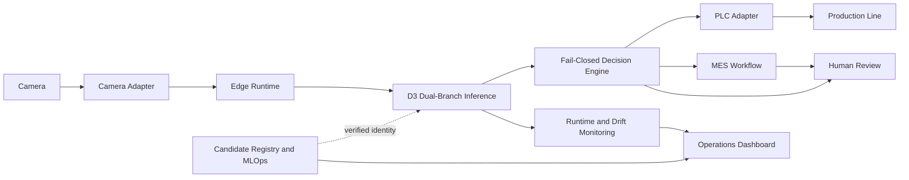
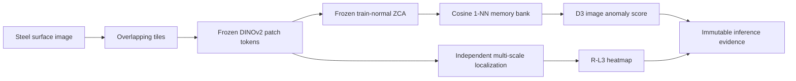
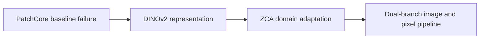
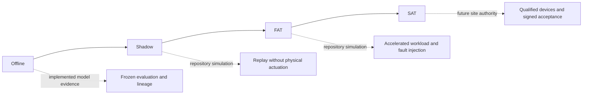

# Industrial Vision AI Quality Inspection Platform: Project Overview

This page is the first-read map for the repository. It summarizes the problem, architecture, AI evolution, industrial interfaces, and validation boundary without treating simulator evidence as a factory deployment claim.

Status terms used throughout this document:

- **Implemented:** capability exists in the repository and is covered by committed code, tests, manifests, or reports.
- **Simulation:** capability has been exercised with deterministic replay, virtual devices, fault injection, or accelerated workloads, but not on a physical production line.
- **Future:** work that must be completed and approved for a specific factory, device set, product domain, and operating policy.

## 1. Project Overview

The platform is an engineering reference implementation for steel-surface visual inspection. It connects a frozen anomaly-detection candidate to acquisition, decision, PLC/MES coordination, human review, monitoring, and model governance.

The design separates four responsibilities:

1. **AI evidence:** image anomaly score, localization heatmap, and artifact lineage.
2. **Quality policy:** deterministic PASS, REJECT, or HOLD decisions.
3. **Industrial execution:** camera acquisition, edge lifecycle, PLC commands, MES workflow, and operator review.
4. **Governance:** immutable artifact identity, validation evidence, promotion gates, drift observation, and rollback.

The D3 package is a qualified production candidate, not an authorization for autonomous production use. See the [D3 model card](release/model-card.md) and [system architecture](architecture/system-architecture.md) for the detailed claim boundary.

## 2. Industrial Problem

Industrial surface inspection is not only an image-classification problem. A usable system must also preserve product identity, tolerate device and service failures, control physical actions safely, maintain audit evidence, and distinguish model validity from site acceptance.

This repository addresses the following engineering questions:

- How can rare or previously unseen surface defects be ranked without requiring a closed supervised defect taxonomy?
- How can image-level detection and pixel-level localization be optimized without allowing one branch to silently change the other?
- How does an invalid frame, timeout, lineage mismatch, field-device failure, or critical drift state become HOLD instead of PASS?
- How are retries made idempotent across PLC commands, MES work orders, and human-review records?
- How can a frozen candidate be traced, validated, monitored, and rolled back without online mutation?

Site optics, material variation, safety interlocks, protocol mappings, operating costs, and acceptance criteria remain factory-specific.

## 3. System Architecture

The inference result is evidence, not a physical command. The decision engine owns quality policy; field adapters own execution; human review appends disposition evidence; governance verifies which immutable package is allowed to load.

Architecture references:

- [System boundaries and safety invariants](architecture/system-architecture.md)
- [AI and industrial data flow](architecture/data-flow.md)
- [Deployment and MLOps topology](architecture/deployment-architecture.md)
- [Industrial network topology](industrial/integration/industrial-network-topology.md)

## 4. AI Pipeline

The image branch uses frozen DINOv2 features, train-normal-only ZCA whitening, and a frozen nearest-neighbor bank. The localization branch uses separately selected multi-scale features. Integration tests require the localization branch to leave the D3 image score and threshold unchanged.

The pipeline is intended for anomaly triage and localization evidence. It does not convert the threshold margin into a calibrated probability, and it does not retrain or recalibrate online.

Evidence: [anomaly-detection design](ai/anomaly-detection.md), [D3 domain adaptation](ai/d3-domain-adaptation.md), and [dual-branch evaluation](dual-branch-evaluation-report.md).

## 5. Engineering Evolution

### PatchCore baseline failure

The initial ImageNet WideResNet-50-2 PatchCore baseline retained useful local defect signal but failed to rank anomalous images above normal images. Because image AUROC depends on score ordering, threshold tuning could not repair the representation failure.

### DINOv2

Aggregation, bank-coverage, and spatial-context investigations did not establish a valid recovery. Frozen DINOv2 patch tokens were therefore evaluated as a representation change, while keeping the anomaly-detection approach non-parametric and avoiding online training.

### ZCA domain adaptation

ZCA statistics fitted only on training-normal features aligned feature geometry with the steel domain. The transformation, encoder, memory bank, and threshold were then frozen and bound to manifests and hashes.

### Dual branch

Heatmap recovery required a representation different from the image-ranking branch. The final architecture preserves D3-ZCA for the image score and uses an independent multi-scale R-L3 branch for localization. This makes branch ownership explicit and prevents localization changes from altering the qualified image decision path.

The complete problem/hypothesis/experiment/result/decision trail is recorded in [failure analysis](engineering-decisions/failure-analysis.md), with focused rationale for [DINOv2](decisions/why-dinov2.md), [ZCA](decisions/why-zca.md), and the [dual branch](decisions/why-dual-branch.md).

## 6. Industrial Capability

| Capability | Implemented | Simulation | Future |
|---|---|---|---|
| Camera Adapter | Vendor-neutral connection, trigger, capture, frame identity, and health contract | Deterministic virtual-camera replay and failure cases | Qualify the target camera, lens, lighting, trigger timing, SDK, and recovery behavior |
| PLC/MES | Fail-closed decision mapping, deterministic command IDs, acknowledgement, work-order, and review contracts | Simulator-backed interaction, duplicate suppression, timeout, NACK, and offline paths | Validate physical addresses, scan timing, interlocks, reject mechanics, MES schema, authentication, and reconciliation |
| Edge Runtime | Config validation, lifecycle control, readiness, health probes, bounded telemetry, and read-only artifact mounting | Container packaging and injected service/resource failures | Qualify target IPC/GPU, drivers, watchdogs, thermal envelope, storage, and redundant power/network |
| Drift Monitoring | Frozen-feature monitoring with NORMAL, WARNING, and CRITICAL policy; no automatic tuning | Deterministic brightness, material-shift, and normal-load scenarios | Establish site baselines, alert ownership, investigation workflow, and recovery authorization |
| MLOps | Candidate registry, SHA-256 artifact identity, lifecycle gates, append-only evidence, and rollback controls | Promotion rejection and disposable rollback drills | Integrate plant change control, access control, signing, backup, approval, and disaster-recovery procedures |

Capability details: [camera](industrial/camera-integration.md), [PLC/MES](industrial/plc-mes-loop.md), [edge runtime](industrial/edge-runtime.md), [drift monitoring](industrial/drift-monitoring.md), and [architecture decisions](engineering-decisions/architecture-decisions.md).

## 7. Validation Lifecycle

| Stage | Current status | Claim boundary |
|---|---|---|
| Offline | **Implemented** | Frozen dataset roles, image and localization metrics, robustness, lineage, artifact hashes, and branch-invariance evidence |
| Shadow | **Simulation** | Repository replay and historical candidate shadow evidence; no physical-line, no-actuation shadow has been completed |
| FAT | **Simulation** | Factory-acceptance software scenarios passed using virtual devices and accelerated discrete-event workloads, not a wall-clock factory shift |
| SAT | **Future** | A plan exists, but a real site must execute it using qualified cameras, lighting, edge hardware, PLC/MES, products, operators, safety controls, and signed criteria |

Passing repository FAT does not imply site production approval. Start with the [validation strategy](industrial-validation/validation-strategy.md), [factory acceptance report](d3-factory-acceptance-report.md), and [simulated SAT plan](industrial-validation/site-acceptance-test.md).

## 8. Limitations

### Implemented

- The repository implements and tests the software contracts described above, with a frozen D3 candidate and independently evaluated localization branch.
- Model and artifact identity are verified before use; runtime monitoring and human review do not mutate the model.
- The dashboard, reports, and demo assets are repository-generated or simulator-backed and are not presented as photographs of a real production deployment.

### Simulation

- Camera, PLC, MES, network, drift, stability, throughput, FAT, and rollback evidence includes virtual devices, deterministic replay, fault injection, or accelerated time.
- Simulator success validates software behavior under the encoded scenarios; it does not qualify vendor hardware, plant networks, line timing, optics, process variation, or machine safety.
- The current model evidence covers the frozen evaluation protocol and cannot be transferred automatically to another mill, camera, material grade, or illumination setup.

### Future

- Execute advisory-only shadow validation on the target line, then a bounded pilot and signed SAT.
- Establish site-specific datasets, acceptance limits, false-positive/false-negative policy, operator workload, containment, rollback, incident, and maintenance procedures.
- Qualify physical protocols, hardware, cybersecurity, network isolation, safety interlocks, long-duration operation, and business value under plant authority.

This documentation set can support a source-level v1.1.0 portfolio release, but it does not change the D3 candidate, inference behavior, threshold, industrial runtime, or production-authorization status.

Continue with the [demo showcase](demo/demo-showcase.md), [industrial integration guide](industrial/integration/factory-integration-guide.md), [industrial validation documentation](industrial-validation/validation-strategy.md), and [technical deep dive](interview/technical-deep-dive.md).
