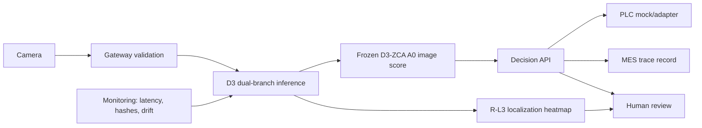

# D3 Release System Architecture

Release package: `steel-patchcore-d3-release@1.3.0`
Frozen candidate: `steel-patchcore-d3-candidate@1.3.0-candidate.1`

## Runtime flow

The image branch is the unchanged D3-ZCA/A0/cosine-1NN branch. The localization branch is the independently evaluated R-L3 multi-scale cosine-distance map. Localization never replaces or modifies the image score.

## Trust boundaries

- Gateway rejects malformed dimensions and missing inputs before inference.
- The release loader verifies the release manifest, dependency lock, candidate manifest, qualification reports and all model artifacts by SHA-256.
- `NORMAL` may map to `PASS`; unresolved anomalies map to `REVIEW_REQUIRED/HOLD`; only a confirmed defect maps to `FAIL/REJECT`.
- Artifact mismatch, missing artifact and model-load failure fail closed.
- Drift produces a warning only. It cannot change thresholds or start retraining.
- The package has no production-promotion operation.

## Frozen references

- Release manifest: `model-training/registry/steel-patchcore-d3-release/1.3.0/manifest.json`
- Dependency lock: `model-training/registry/steel-patchcore-d3-release/1.3.0/dependency-lock.json`
- Candidate manifest: `model-training/registry/steel-patchcore-d3-candidate/1.3.0-candidate.1/manifest.json`
- Release gate: `docs/release/D3_RELEASE_READINESS_REPORT.json`
