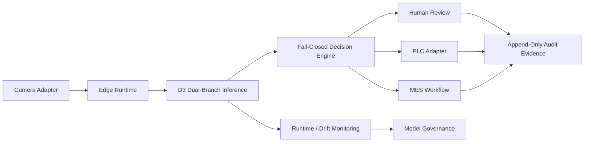

# v1.0.0 Release Notes

- Release type: public portfolio source release
- Project status: production-candidate-qualified reference implementation
- Production authorization: not granted by this release

## Project Overview

Industrial Vision AI Quality Inspection Platform v1.0.0 presents an auditable steel-surface inspection system from image acquisition through industrial action and lifecycle governance. The release packages source code, architecture, tests, operating procedures, and frozen evaluation evidence. Model artifacts and datasets are deliberately excluded.

The release keeps four responsibilities separate: AI evidence, quality-policy decisions, field execution, and human disposition. This separation makes each inspection reconstructable without treating a model prediction as a physical command or final business outcome.

## Architecture

The edge, service, and OT boundaries are documented in the [system architecture](../architecture/system-architecture.md), [data flow](../architecture/data-flow.md), and [deployment architecture](../architecture/deployment-architecture.md).

## AI Capability

- Frozen D3 image-level branch using DINOv2 representations, ZCA adaptation, and PatchCore-family nearest-neighbor anomaly scoring.
- Independent R-L3 multi-scale localization branch for pixel heatmaps; localization cannot change the D3 image score or threshold.
- SHA-256-bound release manifests and explicit model, artifact, dataset, and deployment identities.
- Fail-closed validation for missing, malformed, non-finite, unavailable, or identity-mismatched inference results.

| Evidence | v1.0.0 value |
|---|---:|
| D3 sealed image AUROC | `0.817907171428` |
| Bootstrap 95% CI | `[0.7967992294, 0.8377211833]` |
| R-L3 pixel AUROC | `0.924139385743` |
| R-L3 AUPRO | `0.799398106991` |
| Dual-branch image-score mismatches | `0` |

These values reproduce the committed evidence; v1.0.0 does not retrain, retune, or alter evaluation. See [D3 domain adaptation](../ai/d3-domain-adaptation.md), [anomaly detection](../ai/anomaly-detection.md), and the [dual-branch report](../dual-branch-evaluation-report.md).

## Industrial Closed Loop

The reference flow is Camera -> Edge Runtime -> AI Detection -> Decision -> PLC / MES -> Human Review -> Drift Monitoring.

- `PASS` preserves line operation and records the inspection.
- `REJECT` emits an idempotent reject command and creates traceable MES/review evidence.
- `HOLD` asserts the safe path when acquisition, inference, identity, policy, or field execution is uncertain.
- Human review appends the final disposition without overwriting the original AI observation.
- PLC command IDs and MES event keys suppress duplicate physical or workflow effects during retries.

The current field integration is simulator-backed. See the [closed-loop guide](../industrial/plc-mes-loop.md) and [protocol adaptation boundary](../industrial/protocol-adaptation.md).

## Deployment Capability

- Edge runtime lifecycle and health/readiness gates.
- Docker Compose infrastructure path with host-side GPU inference support.
- Read-only artifact mounting with startup hash and manifest verification.
- Candidate registry, promotion gates, append-only lifecycle history, and fail-closed rollback.
- Runtime resource telemetry, feature-distribution drift evidence, alerts, and operator-visible state.
- Deployment, operation, rollback, and troubleshooting procedures.

Start with the [deployment guide](../operations/deployment-guide.md), [operation manual](../operations/operation-manual.md), and [rollback guide](../operations/rollback-guide.md).

## Test Statistics

The release baseline records:

| Gate | Result |
|---|---:|
| Default Python repository suite | `630 passed`, `1 skipped`, `27 deselected` |
| Frontend unit suite | `33 passed` |
| Frontend TypeScript / Vite build | `PASS` |
| Deterministic factory simulation | `1,000` products |
| Factory acceptance | `PASS` |
| Production-readiness qualification | `PASS` |

Environment-specific GPU, PostgreSQL, OPC UA, and industrial end-to-end gates remain explicit local gates; they are not represented as hosted-CI passes. Commands and evidence are indexed in the [test matrix](../test-matrix.md).

## Known Limitations

- Production-candidate qualification is not production deployment approval.
- Physical GigE Vision / USB3 Vision cameras and PLC/MES gateways require site acceptance testing.
- Modbus TCP and MQTT are documented adaptation targets, not implemented connectors in this release.
- Model evidence covers one frozen steel dataset and one sealed recovery holdout; cross-site generalization is not claimed.
- Frozen model artifacts, pretrained weights, and datasets are not distributed in the public repository.
- GPU inference and field-protocol gates require qualified local hardware and services.
- Drift monitoring creates evidence and alerts; it does not automatically retrain, promote, or mutate the model.
- ROI figures are scenario assumptions rather than audited financial claims.

## Release Scope

This source release is licensed under [Apache-2.0](../../LICENSE), subject to the attribution and third-party scope notes in [NOTICE](../../NOTICE). It contains no D3 model, artifact, threshold, industrial-runtime, or evaluation change.
