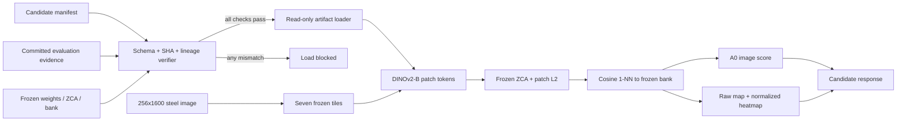

# Steel PatchCore D3 Candidate System Design

Status: `CANDIDATE` only. This design industrializes the already validated D3 method without retraining, recalibration, candidate search, or production promotion.

## 1. Problem

The steel anomaly channel needs a reproducible artifact boundary and a fail-closed loading path. The validated experiment previously depended on ignored run directories and experiment runners. A service could not identify the complete bank/whitening/weights/split lineage from one versioned contract, and an accidental file replacement could silently change inference.

Industrialization therefore means packaging identity and evidence around the existing bytes, not creating new model bytes.

## 2. Baseline failure

The original steel PatchCore baseline used ImageNet WideResNet-50-2 features. Its image-level ordering failed on the Severstal steel domain even after aggregation, spatial-scale, and local-context investigations. The failure was not caused by a missing threshold tweak: anomalous steel patches were not reliably separated in the original representation.

The MVTec PatchCore artifact remains a cross-domain benchmark and is not eligible for steel production. Neither that artifact nor the sealed steel baseline is modified here.

## 3. Root cause

The evidence localized the validity gap to representation/domain alignment. DINOv2 ViT-B/14 patch tokens improved the ordering, while train-normal ZCA whitening adapted the frozen representation to steel texture statistics without using anomaly or holdout data. Full-development confirmation and the sealed recovery holdout both passed the predeclared AUROC/median-order gate.

## 4. D3 solution

The candidate freezes exactly:

- backbone: `dinov2_vitb14`, verified weight SHA256;
- feature: `x_norm_patchtokens`, CLS/register excluded, 18x18x768 per tile;
- adaptation: existing train-normal ZCA mean/matrix, with no recomputation;
- memory: existing 50,000-row seed-42 reservoir bank;
- distance: per-patch L2 followed by cosine 1-NN distance;
- tiling: 256x256 crops at x offsets 0, 256, 512, 768, 1024, 1280, and 1344;
- image aggregation: A0 global maximum over all raw patch distances;
- threshold: full precision `0.8471092581748962`, loaded from the manifest.

The registered identity is `steel-patchcore-d3-candidate@1.2.0-candidate.1`, artifact version `d3-full-development-9b1ea19`.

## 5. Architecture



The file registry only implements register, verify, and load for `CANDIDATE`. It contains no STAGING or PRODUCTION transition. The existing production deployment manifest is unchanged.

## 6. Artifact lineage

The committed registry manifest is [manifest.json](../model-training/registry/steel-patchcore-d3-candidate/manifest.json). Its canonical payload hash protects the schema contents; loading also hashes every referenced file.

| Item | SHA256 |
|---|---|
| DINOv2-B weights | `0b8b82f85de91b424aded121c7e1dcc2b7bc6d0adeea651bf73a13307fad8c73` |
| Full-development ZCA | `c8d9d2ed39fb7ba6d0013a27beba81e8d7b70c66da0e38b7d19e15ea7cae8c3a` |
| Full-development D3 bank | `40fe43331885422c8a32364a48fc403b766f807f69faafee775a2eb2403cbbda` |
| Source split | `64df9f817a995e64c7ee4d00e16962d94f500878fd1404d95227f26e7f913d07` |
| Recovery split | `f60ce0a6aa012ad1d9a9636800c1e94f365940500f20b8deb2f7fd9ffbc55448` |
| Full-development result JSON | `1d511ccd20a6c007f6f0b298de8e7b5bd649ff6c229a183b60c06dda1bbca35c` |
| Recovery-holdout result JSON | `0d5e16663e327accdeeb9fc32a37193432fbca9753b83cd17249fc527361529e` |

Evidence verification cross-checks the hashes embedded inside both committed result files against the candidate manifest. Arrays are loaded with pickle disabled, shape/finite checks, and read-only NumPy flags. They are hashed again after loading.

## 7. Evaluation evidence

Full development:

- verdict `D3_FULL_DEVELOPMENT_CONFIRMED`;
- image AUROC `0.8362`;
- Q1-Q4 `0.7372 / 0.8087 / 0.8676 / 0.9312`.

Sealed recovery holdout:

- verdict `RECOVERY_HOLDOUT_PASS`;
- image AUROC `0.8179071714`;
- bootstrap 95% CI `[0.7967992294, 0.8377211833]`;
- Q1-Q4 `0.729817 / 0.781463 / 0.837311 / 0.923192`.

The score-only evaluation module consumes an explicit dataset manifest and completed per-image records. It rejects duplicate, foreign, missing, role-confused, non-finite, or unstratified records and emits JSON containing metrics, lineage, timestamp, artifact hashes, and a deterministic evaluation fingerprint.

## 8. Deployment design

Candidate inference is opt-in with `IVQC_D3_CANDIDATE_MANIFEST` pointing to the committed candidate manifest. Without that variable, the existing anomaly configuration remains unchanged. Setting the variable does not change registry status and is intended for controlled candidate validation only.

The predictor returns the stable candidate payload:

```json
{
  "anomaly_score": 0.0,
  "threshold": 0.8471092581748962,
  "is_anomaly": false,
  "model_version": "1.2.0-candidate.1",
  "artifact_version": "d3-full-development-9b1ea19"
}
```

The shared anomaly contract retains `is_anomalous` for backward compatibility and adds optional `artifact_version`. Raw localization is a 256x1600 patch-distance map: each 18x18 raw tile grid is bilinearly expanded and overlap-mean stitched. A separate global min-max map supplies the review heatmap. A0 is computed from the raw tile grids before resize, stitch, or normalization, so heatmap generation cannot alter the image score.

## 9. Limitations

- This remains a candidate validated on one frozen steel dataset and one sealed recovery holdout.
- The full-development threshold has very low anomaly recall at its operating point; those confusion metrics are diagnostic and were not part of the rank-based validation gate.
- Q1 is weaker than larger-defect quartiles.
- The new heatmap path is geometrically based on patch distance but has not received a separately authorized pixel-localization acceptance gate.
- Runtime latency, concurrency, memory pressure, and target-line hardware acceptance are not established by this task.
- Candidate opt-in is not production deployment or production approval.

## 10. Future work

Future work requires separate authorization: external/site-shift validation, a declared pixel-localization protocol, performance/load qualification, operational monitoring thresholds, security review, and an explicit production promotion decision. Threshold optimization, backbone search, fine-tuning, new datasets, and Optimization 3 are outside this task.
